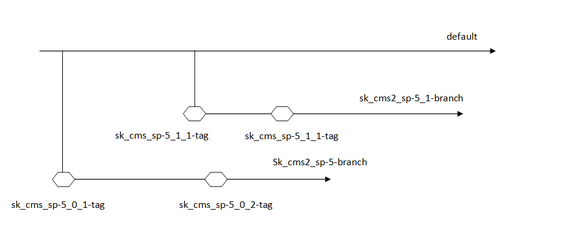

SAS Configuration Management
=============================

Introduction
------------
This document covers the configuration management (CM) standards and routines for the SAS project. The purpose
of this plan is to define a way to work with several target releases at the same time in a controlled manner. Make it 
possible to trace changes to the code, clearly identify and to recreate any release. 

General Information
-------------------

Mercurial main repository
^^^^^^^^^^^^^^^^^^^^^^^^^

The main mercurial repository is hosted on SAS servers and a SAS user with a correctly setup SSH configuration is necessary to access it.

The main mercurial repository is located on the SAS server v1cmsapp1t in the dir /mercurial/sk_cms_user.hg

Mercurial configuration
^^^^^^^^^^^^^^^^^^^^^^^

Each user can specify Mercurial configuration options in a file named .hgrc in their home folder.

Recommended Mercurial configuration template:

 ::
 
   [ui]
   username = Firstname Lastname <firstname.lastname@jeppesen.com>
   editor = /usr/bin/vim -c "r /carm/proj/skcms/sk_cms_cm/etc/commit_template.txt"
   [extensions]
   hgk =
   extdiff =
   [extdiff]
   cmd.meld =
   cmd.tkdiff =
   cmd.kdiff3 =

Put this in your .cshrc/.tcshrc file:

source /carm/proj/skcms/sk_cms_cm/bin/setup_SAS_environment.sh

Work Overview
-------------

The work is done in branches and tags are used to identify release. Below is a picture describing the
general workflow.

Most changes are done in the default branch while the intention is to only make bug fixes in the release branches.
Before a release is deployed to PROD it is tested in PROD_TEST so it common that one release branch is used PROD,
another in PROD_TEST while the development is made in the default branch.

The goal is to keep the work in the release branches to a minimum, only bugs shall be fixed in these branches and
ideally all bugs are found before creating the branch. If errors are found at SAS and they need to be fixed in the
release branch, it is transplanted to the default branch as well (and possibly the other release branches). 

Branches
--------

Branches is used to be able to make it possible to work on several releases at the same time. The main branch
is called default in Mercurial and here is where most of the work is done. It is always targeting the next major
release.

There are two types of branches plus the default branch. 

  - Release branches
  - Development branches

There are usually a number of active branches, the default branch and a number of releases branches for
old releases. Development branches are quite rare. 

Naming maintenance branches
^^^^^^^^^^^^^^^^^^^^^^^^^^^

sk_cms2_sp-<X>_<Y>-branch

<X> = major release number 

<Y> = minor release number if > 0 otherwise blank and the proceeding underscore is removed. 

Example:
  ::
   
    sk_cms2_sp-10_2-branch

Naming development branches
^^^^^^^^^^^^^^^^^^^^^^^^^^^

The branch naming of development branches may be choosen rather freely.

<name>-branch

<name> = name describing the purpose of the branch

Example:
  ::
   
    select_and_operate-branch

Tags
----

Tags are used to identify releases.

Naming standard
^^^^^^^^^^^^^^^
sk_cms2_sp-<X>_<Y>_<Z>-tag

<X> = Major release number

<Y> = Minor release number

<Z> = Starting at 1, and then incremented for each release

Example:
  ::

    sk_cms2_sp-10_2_2-tag

How-tos
-------

Create/Check out a new CARMUSR
^^^^^^^^^^^^^^^^^^^^^^^^^^^^^^
Some environment variables are setup by the setup_SAS_environment.sh so it should be sourced or put in the shell 
init file. The enviroment should be setup both when checking out the CARMUSR and when using it.

source /carm/proj/skcms/sk_cms_cm/bin/setup_SAS_environment.sh
A script located in /carm/proj/skcms/bin/make_sk_cms_user is used to create a new CMS2 user. It has a lot of 
options and help is outputted when executing the script without arguments.

Check out the user from the default branch in ~/work/tests/ by executing the following command:

/carm/proj/skcms/bin/make_sk_cms_user default

Clone the main repository
^^^^^^^^^^^^^^^^^^^^^^^^^
  ::
  
     hg clone ssh://v1cmsapp1t//mercurial/sk_cms_user.hg

Create branch
^^^^^^^^^^^^^

There are three steps, create the branch, commit and push the changes to the world:

Example:  
  ::
    
    hg branch sk_cms2_sp-10_2-branch
    hg ci -m "start sk_cms2_sp-10_2-branch"
    hg push --new-branch

Switch to a  branch
^^^^^^^^^^^^^^^^^^^

hg update <branch name>

Example:
  ::
    
    hg update default
    hg update sk_cms2_sp-10_2-branch

List branches
^^^^^^^^^^^^^

To list existing branches, use the hg branches:

  ::
    
    hg branches

Tagging
^^^^^^^

There are two steps, update to the branch and then set the tag.

  ::
  
    hg update <branch name>
    hg tag sk_cms2_sp-X_Y_Z-tag

List tags
^^^^^^^^^
To list existing tags, use the hg tags:

  ::
  
    hg tags

Transplant changes
^^^^^^^^^^^^^^^^^^

Goto to the target branch, transplant and push

  ::
   
    hg update <branch_name>
    hg tranplant <change id>
    hg push 

 
Listing change sets
^^^^^^^^^^^^^^^^^^^

To get a list of change sets with the changes in branch sk_cms2_sp-10_4-branch between sk_cms2_sp-10_4_1-tag and 
sk_cms2_sp-10_4_2-tag. Includes files and check in comments. This is the substitute for the release_documentation file.

  ::
   
    hg log -v -b sk_cms2_sp-10_4-branch -r sk_cms2_sp-10_4_1-tag:sk_cms2_sp-10_4_2-tag