=========
Crew Meal
=========

Summary
-------

Carmen CMS is responsible for creating crew meal orders, order updates and forecasts. 
How it works, how to use the application and the different user interfaces, inputs and
outputs, are described shortly in this document.

Introduction
------------

This Document
^^^^^^^^^^^^^

This document is a functional reference. It tries to explain everything that the
user needs to know about the application to be able to use it to perform the
tasks it is intended for.

References
^^^^^^^^^^

===== ======================================== ========== ===============
Id    SAS Document                             Version    Author
===== ======================================== ========== ===============
[S1]  PS07 CMOS Requirement Specification 1.0  Draft      Jan F. Andersen
[S2]  Crew Meal rules.doc                      No version Bill Hemsworth
===== ======================================== ========== ===============

|
|

===== ================================ ======= ====================
Id    Jeppesen Document                Version Author
===== ================================ ======= ====================
[J1]  System Reference Manual          2.0     Jonas Carlsson
[J2]  Integration Functional Reference 1.2     Robert Tropp Larssen
[J3]  Functional Reference FileReader  1.0     Robert Tropp Larssen
[J4]  Functional Reference Common      1.0     Robert Tropp Larssen
[J5]  Carmen CMS system admin guide    1.0     Jeppesen Systems AB
[J6]  UDM                              5.2.0   Christoffer Sandberg
===== ================================ ======= ====================

General Crew Meal description
-----------------------------

Functionality
^^^^^^^^^^^^^

The Crew Meal is a client server solution.

There are two clients:
 * A GUI for manual handling
 * A scheduler that automatically triggers running of Meal Order jobs according
   to a configured schedule.

The server actually does the job. It has the following capabilities:
 * Generate new orders/reports data.
 * Generating actual order/report files
 * Cancelling orders/reports
 * Sending mails to suppliers
 * Sending copies to others
 * Sending error reports

In the background the CARI system is notified of created and cancelled meal
orders.

Architecture
^^^^^^^^^^^^

Below is a logical flow chart describing running of a job creating a meal order.
On the left axis you can see the different architectural layers.

.. _figure-job-flow-chart:

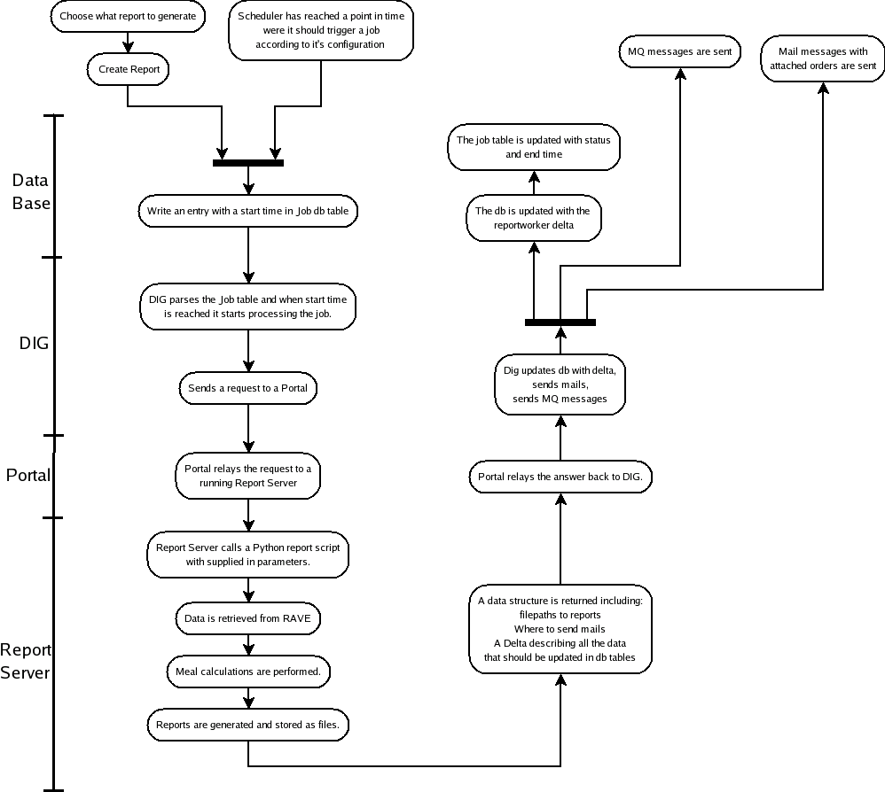

   Job processing flow chart

Data
^^^^

Crew meal uses database tables to safely store data. It is of two types:
 * Basic Data, which is static data that sets up things like, used categories,
   preferences for suppliers and so on.
 * Generated order data, which is the data calculated when creating new
   orders/reports.

The end product is the data files that will be sent to the suppliers. They
contain all info the suppliers need, in a pdf or a xml format.

For each created order data is stored in the database. The actual created data
files are placed in a directory on the server (see setting *ExportDirectory* in
:ref:`studio-resource-label` ).
The stored data contains paths to the files, so they can be used when sending
out messages to suppliers.

Settings
^^^^^^^^

.. _studio-resource-label:

Studio resources
""""""""""""""""

Studio resources can be changed in studio under menu :menuselection:`Options -> Resources`.

**Export Directory**

   This parameter controls where generated reports are saved on the server.

   The output directory is set under *default (Application) / meal (Module)*.
   The name of the parameter is ``ExportDirectory``.

   The default value is set to ``$CARMUSR/current_carmdata/REPORTS/MEAL``.

.. _parameters-label:

Parameters
""""""""""

There are two different types of parameters; parameters defined in RAVE and
parameters defined in the database. The advantage with database parameters
are that they are easier to configure and does not require a report server
restart.

How many days ahead the meal order should be run  is controlled by the Rave
parameter ``order_horizon``.

How many legs that should be followed backwards in the aircraft rotation to find
a supplier, before trying a lower priority criteria, is controlled by the Rave
parameter ``max_legs_bwd``.

In studio menu :menuselection:`Planning Tools --> Rule Parameters`:
They look like:

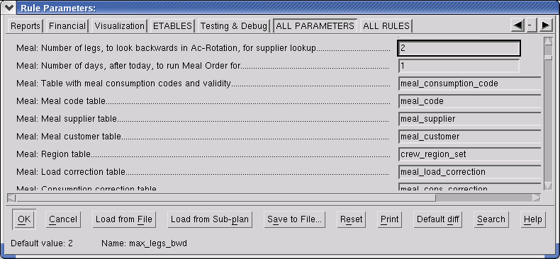

   . Studio meal parameters

These parameters are specified in the Rave module ``report_meal``.
They can be overridden for the session by changing the parameters from within
Studio. These changes can be saved in the parameter file to be used each time
Studio is started.

*Note*: If overridden values shall apply to the Crew Meal application, the
values must be saved in the parameter set used by the report server. The report
server must be also restarted.

Which parmeter set is used by the various report servers is configured in:
``$CARMUSER/etc/programs/reportworkerstudio.xml``.

The files for the report server parameter set are located in 
``$CARMUSR/crc/parameters/tracking``. There is also a parameter set located in  
$CARMDATA that is individual per user and overrides  the ``$CARMUSR/crc/parameters/tracking`` 
when from a Studio session.

The update logic uses almost the same logic as the ordinary meal orders. There are two
parameters that only are used for update and they are both located in the database
table property and is named meal_order_update_horizon and meal_order_update_offset.

The meal_order_update_horizon is used to configure how many hours before the load flight
update order shall be created. E.g. the update order will be created at 12:00 if the 
parameter is set to 4:00 and the load flight departures at 16:00.

The meal_order_update_offset is a parameter that shall be changed in conjunction with
the DIG job scheduling. It states the time before and after the update time that will 
be considered when creating the update order. E.g. if the the DIG schedule states that
update orders shall be executed every 10:th minute the meal_order_update_offset must be
at least 0:05 minutes. There is a variation from the DIG schedule and the real execution
of jobs so it is recommended to add some safety margin. The current update DIG job is
executed every 10:th minute and the meal_order_update_offset is initially set to 0:10 
minutes. This means that there will be a overlapping between to update jobs but a update
orders will only be created once for each flight. 

.. _manual_runs-label:

Manual Runs
-----------

Overview
^^^^^^^^

The crew meal application provides tools to manage the meal orders and reports.
It is started directly from the Launcher application.
 
It consists of two parts, a GUI that users work in, and a server that actually
does the job. The reason for this is that we reuse the same functionality and
infrastructure that the automated meal order generation uses. This has a number
of consequences:

 * The GUI can be used to perform many tasks without waiting for completion of
   the previous tasks.
 * The GUI application can be closed down without interfering with already
   running jobs.
 * The user will have to wait until the job is finished before checking the
   result.
 * The user needs to refresh the GUI in order to see changes, made by the server,
   to the relevant tables in the database.
 * Status of the started jobs can be seen in the job table.

Since the actual processing is done by a server there will be some delays,
approximately:

 * Jobs should be started within 10s
 * Jobs should be finished within a few minutes

These are normal values and depend on how the DIG channel is configured and load
on the machines running the processes.

In the crew meal form (GUI) there are two tabs, one to manage orders and one for
forecasts. There are also two menus, one to edit basic data related to crew
meals, and one to view status of started jobs.

*Note:* Shown orders/forecasts are filtered for a time period, see :ref:`filtering-of-order-data-label`.

Meal Order
^^^^^^^^^^

This section describes manual meal order handling. 

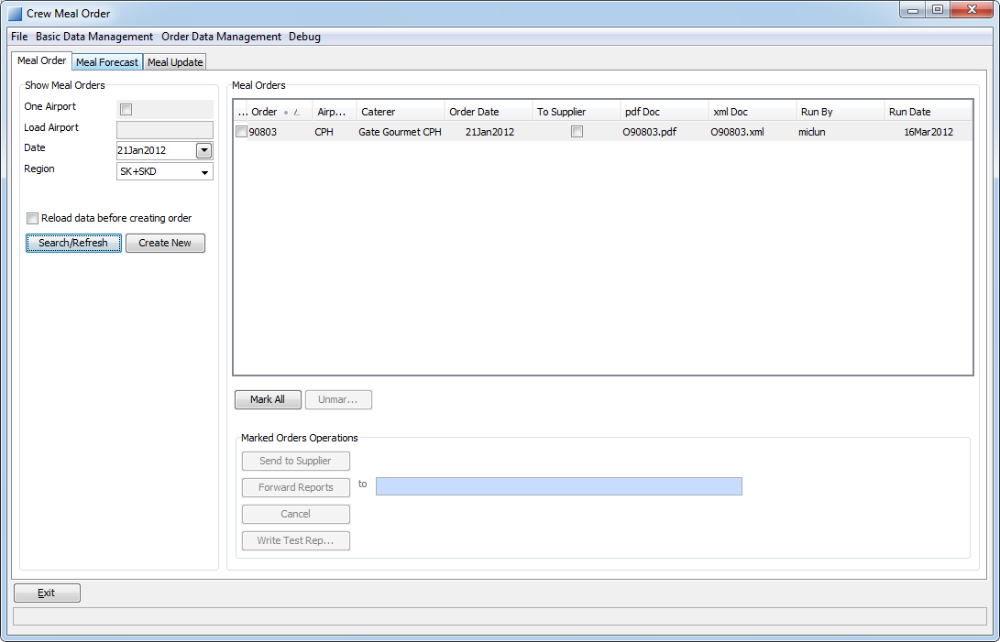

   The meal order tab

On the left is a box *Show meal orders*. Inside are fields to fill in and buttons
that uses these values, to create new orders or search for existing orders.

There is also a checkbox to force reload data in the server, which makes recent
changes to basic data apply. It's a trade-off between fresh data and execution
time.

On the right is a box *Meal Orders*. On the top there is a list of orders which
you can select, to process with the buttons below.
 
Meal Order Columns
""""""""""""""""""
============== ================================================================
Column         Description
============== ================================================================
Order          ID number of an order
Airport        The airport the order is intended for
Caterer        The caterer the order is intended for
Order Date     The date that the order is intended for
To Supplier    Indicates whether the order has been sent to the supplier or not
Pdf Doc        Name of the orders pdf file, if any
Xml Doc        Name of the orders xml file, if any
Run By         The unix id of the user that created the order
Run Date       The data the order was created
============== ================================================================

Create Orders
"""""""""""""

It is possible to create an order for one station or for all stations where a SAS
region has flights with crew meal load.

 #. Choose whether the order shall be created for one or for all stations
 #. If the order will be created for one station, enter the three letter airport code
 #. Select the date the order should be created for
 #. Select SAS region. It must be in the format *company + region*, i.e. ``SK+SKS``
 #. Click *Create New*
 #. Job is sent to server

Meal orders are created, according to the given parameters, for each caterer
where meals will be ordered from. The created orders are shown in the area to the
right when job is finished and *Search/Refresh* is pressed.

*Note:* If the checkbox *Reload data before creating order* is checked, the
server will refresh the data from the database which might take a few minutes.
The purpose is to make sure that recent changes in basic data are used.

Search Orders
"""""""""""""

It is possible to search for orders for a specific station or for all stations.

 #. Choose to search for orders at one or all stations
 #. If the search be performed for one station, enter the three letter airport code
 #. Select a date
 #. Select SAS region
 #. Click *Search/Refresh*
 #. A list of meal orders matching the search parameters are shown in the area to the right

Send Report
"""""""""""

 #. Check the orders to send out reports for in the list
 #. Select if you want to override recipients, and in that case enter mail
    addresses separated by comma. If not, the addresses from *supplier* basic
    data table will be used
 #. Click the *Send Reports* button
 #. Job is sent to server

The *To Supplier* field will be checked when *Send to Supplier* is finished on
the server side. At the same time the CARI system is notified if it is a Meal
Order.

The *To Supplier* field will be updated on the server side, so there is a delay
before the change is reflected in the client.

*Note:* No test reports will be sent, only reports shown in the *pdf Doc* or
*xml Doc* fields in the list.

Cancel Orders
"""""""""""""

 #. Check the orders to cancel in the list
 #. Click the *Cancel* button
 #. Job is sent to server or deleted directly

If the order has been sent, a cancellation job is sent to the server that marks
the order as cancelled and sends cancel messages and notifies CARI system if it
is a Meal Order. The client need to be refreshed to display changes in the order
list.

If the order has not been sent, the entry is deleted from the table. The order
list is automatically updated.

Write test reports
""""""""""""""""""

 #. Check the orders to write reports for in the list
 #. Click the *Write test reports* button
 #. Job is sent to server

All applicable reports are created.

They will be placed in the meal output directory, where they can be viewed, for 
instance using the File Reader application.

Meal Forecast
^^^^^^^^^^^^^

In this section manual meal forecast handling is described. Below an image of
the forecast tab in the meal order form is shown.

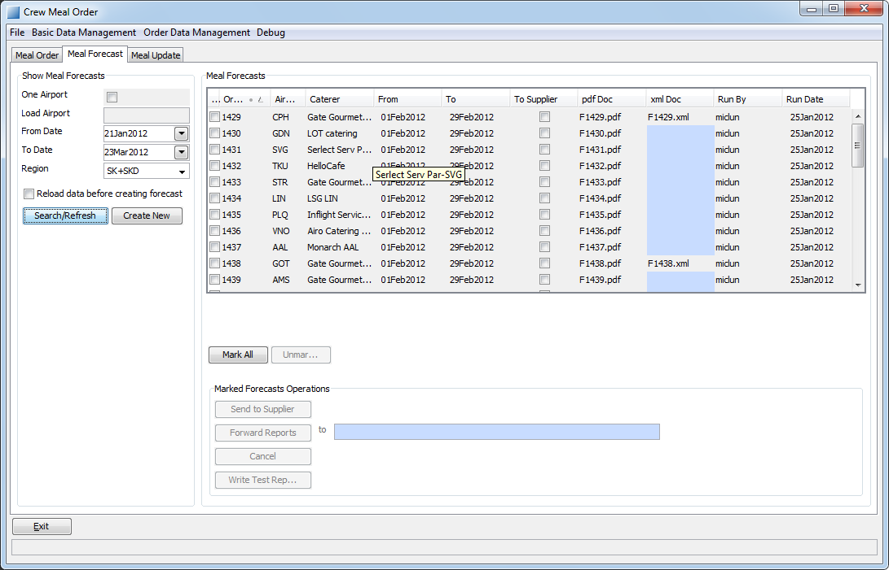

   Meal Forecast Tab

The manual handling of the Forecast works the same way as the Meal Order,
described previously, with the following exception:

There is a *From* and *To* column. This is used to set the date interval the
report should cover, when creating forecasts.

When doing a search, this interval is used to search for Forecasts with a *From*
date in the interval.

Note that there is a slight difference of meaning in the two cases.

Meal Update
^^^^^^^^^^^

In this section meal update orders are described. Below is an image of the update tab in 
the Meal Client.

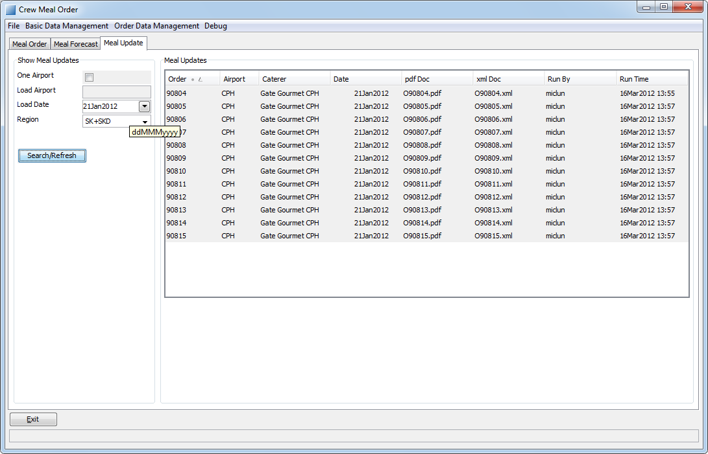

   Meal Update Tab

It is not possible to create manual update orders so the Crew Meal client is only used
to display existing update orders. The columns for an update order is also different
and is described in the table below. 

============== =======================================================================
Column         Description
============== =======================================================================
Order          ID number of an order
Airport        The airport the order is intended for
Caterer        The caterer the order is intended for
Date           The date that the order is intended for
Pdf Doc        Name of the orders pdf file, if any
Xml Doc        Name of the orders xml file, if any
Run By         The unix id of the user that created the order
Run Time       The the time the order was created (4h before load flight by default) 
============== =======================================================================

To find more information about the content of update orders, the menu option 
"Order Data Management->Meal Update Orders" may be used. In this form it is possible
to see the amount of meals etc. that has been ordered for a certain flight.

Editing Basic Data
^^^^^^^^^^^^^^^^^^

In order for the Crew Meal to work properly there is a number of data that must
be kept up to date. This is done by choosing one of the tables from the Basic
Data Management menu.

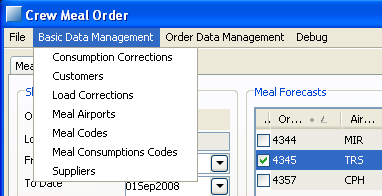

   Basic Data Management menu

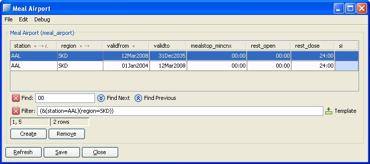

   Basic Data Editor

Above is an example of how the editor for a table looks. You can modify content
of cells by clicking in them, add new rows and remove existing rows. You can mark
intervals of rows, to delete, by clicking interval start row, and then shift
click interval end row.

Commands
""""""""
================= ================= ===============================================
Menu command      Keyboard shortcut Description
================= ================= ===============================================
File - Refresh    :kbd:`Alt-r`      Refreshes data from database
File - Save       :kbd:`Alt-s`      Commits changes to database
File - Close      :kbd:`Alt-c`      Closes form, discarding changes since last save
Edit - Create     :kbd:`Alt-t`      Create a new blank row
Edit - Remove row :kbd:`Alt-v`      Delete marked rows
Edit - Find       :kbd:`Ctrl-f`     Show Find List
Edit - Filter     :kbd:`Ctrl-l`     Show Filter List
================= ================= ===============================================

*Note:* :kbd:`Ctrl-f` and :kbd:`Ctrl-l` are context sensitive. The table must be
clicked before they work.

Filtering
"""""""""

The filter is complex and not really intended for end users. It is useful under
certain conditions however.

A filtering example::

  (company=SK)
  (station.id=AA*)
  (&(email=*.se)(region=STOCI))
  (|(department=*CS)(phone1=45*))

Filtering operators:

=================================== =================================
Operator                            Description
=================================== =================================
``&``                               Logical and
``|``                               Logical or
``*``                               Wildcard, matching any characters
``>``, ``<``, ``>=``, ``<=``, ``=`` Comparison operators
=================================== =================================

The names of the columns are the actual database names as shown in the help text
when hovering with the pointer over a column header.
If the column refers to another table you need to add that tables column name to
use wildcard, i.e ``(station.id=AA*)``.

*Note:* No rows containing empty values, times or dates match the wildcard character.

Clicking the template button puts a template in the filter field, to use as a
start to build your filters.

Clicking the x button just hides the filter list. It is still active, even if
you close and reopen the form.

A filter is activated by pressing return. Deactivating a filter is done by
opening the filter list, emptying the filter and pressing return.

Dates and intervals explained
"""""""""""""""""""""""""""""

The use of date columns in the basic data tables is not entirely intuitive so
this section will give a breif description to how it works.

When you write *15Dec2008* it is actually represented as *15Dec2008 00:00*. In
other words, a date is handled as a timestamp for the start of that day.

Intervals are including the *validfrom* and excluding the *validto* value.

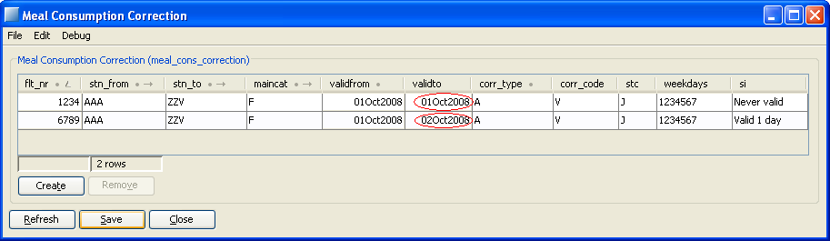

   Example of intervals

To get one day you need to write like the bottom line above. If you do it like
the top line it is never valid.

Data change propagation
"""""""""""""""""""""""

There are several possible sources for basic data updates using the CMS
applications.

All CMS applications have the following two data layers:

 * The database.
 * The model, which is an object representation of the data, kept in memory.
   This is the layer where all processing is done.

For data changes made in one application to be visible in another the following
must be done:

 * Changes in the model in first application must be committed to the db. 
 * The second application must refresh its model from the db. 

This has a number of consequences in different applications:

 1. In CCT studio, the table editor only works on the model, so to commit changes you need to:

  * Save to model in the table editor
  * Save the model to db, in studio, this of course means that you save all changes done to the plan.

 2. In standalone tableEditor you can commit changes to the db directly.
 3. The same in Crew Meals Basic Data Management 

The server side of Crew Meal refreshes the data every 60s for ``SAS_RS_WORKER_LATEST``.
The latest date is used for both meal orders, forecasts and update orders.  

So if you change basic data you cannot be sure that it affects creation of orders
started sooner than these times. Note that there is a checkbox to force reload of
data.

*Note:* The examples given above depend on how the system is configured and also
changes in the individual applications might change the behavior.

.. _checking-job-status-label:

Checking job status
^^^^^^^^^^^^^^^^^^^

To see if a started job is finished yet, choose the :menuselection:`Job Status`
command from the :menuselection:`File` menu. This shows a read only view of a
table with all created jobs.

Shown data:

 * when, or if, the job was started
 * if it is finished
 * what the job does
 * status of the finished job

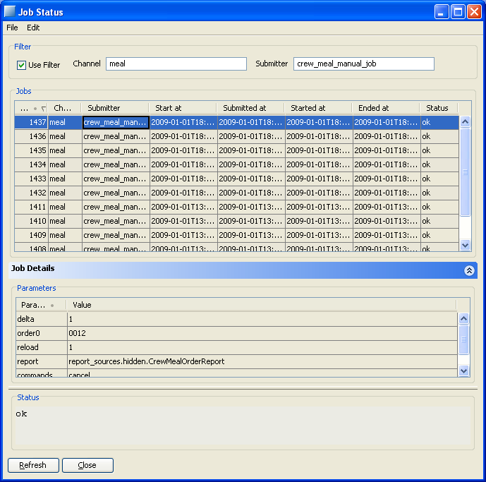

   Job table

The following columns are filled when job is initially written in the table:

 * *Channel* is the DIG channel that the job will be sent through.
 * *Submitter* is a name of  the application/task that put the job in the table
 * *Start at* is the time after which the job shall be started.
 * *Submitted at* is the time the submitter put the job in the table.

The following columns are filled in when the job is being processed:

 * *Started at* is filled with a timestamp when the job is started
 * *Ended at* is filled with a timestamp when the job is finished
 * *Status is* filled with the status of the finished job, see 
   :ref:`parameters-and-status-label`

Filtering
"""""""""

In the top of the form you can select if you want to filter the table of jobs,
and which filter to apply to the *Channel* and *Submitter* columns. The default
is to only see the *meal* channel and manually submitted jobs.

All meal jobs submitted manually have submitter *crew_meal_manual_job*, and all
automatic jobs have *pub_MealOrderTask*, *pub_MealForecastTask*, and *pub_MealUpdateTask*.

An empty value in a filter matches everything.

A text matches only exactly that text.

``*`` can be used as a wildcard in the filters.

Examples:

 * ``pub*`` matches ``pub_InterbidsTask`` and ``pub_MealOrderTask`` but not
   ``crew_meal_manual_job``
 * ``pub`` matches only ``pub``

.. _parameters-and-status-label:

Parameters and status
"""""""""""""""""""""

When you select a line in the job table, the corresponding values are shown in
the *Job Parameters* and *Status Message* sections.

The parameters are the ones sent to the server side, and reflect the input you
gave in the GUI. The following might be useful to understand:

*commands*
  A semicolon separated string of commands, se details below.

*loadAirport*
  Used as in parameter for *create* commands
*fromDate*
  Same as above
*toDate*
  Same as above
*company*
  Same as above
*region*
  Same as above.
*runByUser*
  Same as above.
*emailX*
  Email address.
*orderX*
  Meal order nr.

*Note:* The X above is the consecutive number of the param starting at zero.
    
Available commands:

 * *cancel*
 * *testAllReports*
 * *create*
 * *send*

Note that 'Send' can be used alone or together with one of the others.

The *Status Message* is filled with results of the job. It is empty until the job
is finished and then contains *OK* or error information.

The error information is currently not very informative, as it only contains the
first 256 characters of a stack trace, but this will be improved in future
versions of DIG.

Batch Runs
----------

This functionality creates and sends meal forecasts every month for all caterers
with meal orders the coming month. Meal orders will also be automatically 
created and sent each day for all caterers with meal orders the coming day. 
A batch run will also be triggered periodically to check if updates to the daily
meal orders are needed. The updates will check load flights a few hours ahead and 
an update order will be created for each flight with meal shortages. 

See :ref:`parameters-label` how to configure batch runs.

This functionality is realized by two Jeppesen components, DIG (Data Integration
Gateway) and the Report Server.

Description of the workflow:

 * The scheduler in DIG puts jobs in the job table according to a XML
   configuration file
 * DIG sends the job to a Report Server
 * The Report Server generates orders or reports and returns a list of responses
   when finished
 * DIG processes the list and sends appropriate emails and MQ messages

For more information see: *PS07 CMOS Requirement Specification*, Chapter *Server
Applications* contains an overview.

It is possible to configure when the jobs shall run, i.e. changes can be made in
a configuration file that describes what jobs and when they should be run, i.e.
``$CARMUSR/etc/dig/digscheduler.xml``. When the scheduler is restarted
the new behaviour is applied.

Note that the jobs are entered in the same job table as the manually created
jobs.

See :ref:`checking-job-status-label` for a description of how to see status of
jobs.

*Note:* See reference documents for details on configuring:
 * *Integration Functional Reference*, especially chapter *Setup* that describes
   where the different configuration files can be found.
 * *Carmen CMS system admin guide* where chapter *Common configuration*
   describes the formats, conventions and tools to be used in configurations.

Data and report generation
--------------------------

Rave
^^^^

All union agreements that governs where meal breaks are assigned are modelled in
the Rave module ``meal``.

Everything that has to do with assigning meal codes and consumption codes is
implemented in Rave module ``report_meal``. It also holds logic for supplementary
meals, where to load meals, and all support needed by the Python report.

The source files are found here in the user::

  $CARMUSR/crc/modules/meal
  $CARMUSR/crc/modules/report_meal

In Tracking studio there is a leg context menu, to force meal stop on a leg.
There is also a choice to prevent a stop. This affects the calculation of meal
stops but is not shown in the chart, because it is meant to be used after the
orders has been generated. See TODO_fix_ref:Tracking Functional Reference for details.

Below is a logical flow chart for assigning meal breaks, which is the core
functionality. Note that use use of database tables are illustrated by curved
arrows to/from a database symbol with a table name below.

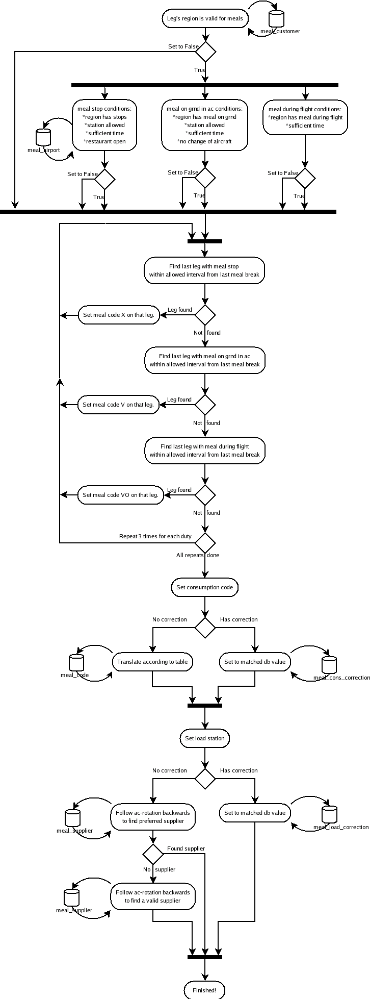

   Meal breaks flow chart

Python
^^^^^^

The actual processing of reports and storage of data is done by a Python report
called by a report server.

The source files are found here::

$CARMUSR/lib/python/report_sources/report_server/rs_CrewMealOrderReport.py
$CARMUSR/lib/python/meal/

The actual meal logic is located in ``$CARMUSR/lib/python/meal/``.

Below on the left, is a flow chart of creation of data, and on the right creation
of the actual report file.

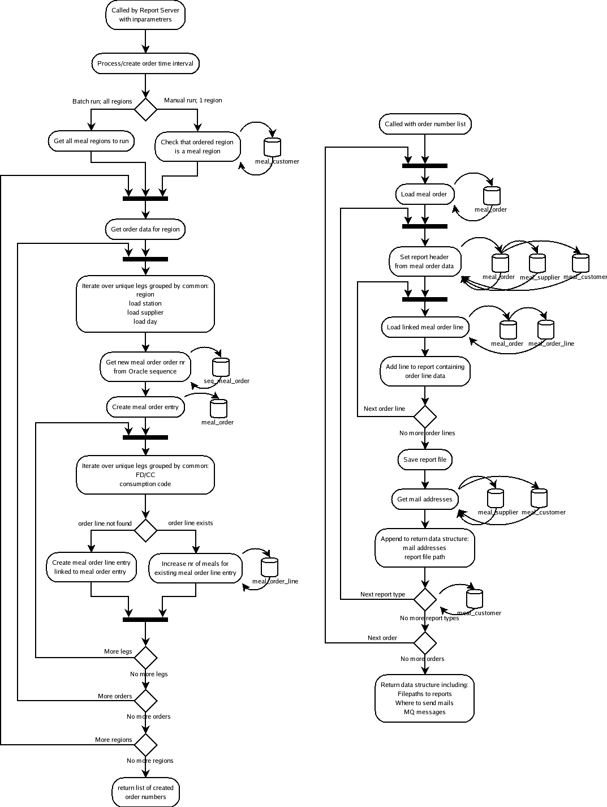

   Data and report creation flow chart

Order Sending and Error Feedback
--------------------------------

The output from the meal order creation is usually that some orders are sent to the supplier
and the customer. Notifications are also sent when error occurs.

Overview
^^^^^^^^

Here is an overview of the the outputs from the meal order creation and how the destination is
configured. 

======= ========= ===========================================================================================
Format  Protocol  Destination Configuration
======= ========= ===========================================================================================
PDF     E-mail    Column in the meal_supplier and meal_customer tables
XML     E-mail    Column in meal_supplier and meal_customer tables
CARI    MQ        Configurable via dig_receipients (CreateCari and DeleteCari are individually configurable)
TELEX   E-Mail    Column in the meal_supplier table
ERROR   E-mail    Configurable via dig_receipients 
======= ========= ===========================================================================================

The PDF and XML desinations are e-mail addresses that are specified in the meal_supplier and meal_customer
tables. They are not affected by the dig_recepients tables.

CARI is sent via MQ and is configured by the dig_recpients tables. The dig_recepients tables specifies
the destination queue.

Telex is like an e-mail and is only used for update orders. The destination is extracted from the meal_supplier
table. It is not affected by the dig_recepients tables.

Error may be divided into two categories, handled and unhandled errors. The destnation of errors that are not 
explicitly handled in the code is hardcoded in the channel configuration. Normally, this shall never happen. 
The handled errors may occur from time to time and may have different reasons but probably inconsistend data
or a bad configuration. The destination (and other attributes) may be configured by using the dig_recepients
table in the database.  

.. _recepients-configuration-label:

Recepients Configuration
^^^^^^^^^^^^^^^^^^^^^^^^

The DIG Recepients configuration consists of the following tables and it used to configure where
messages will be sent without making any changes to the code. The code module using the tables and redirecting
messages is named UserConfigurableDispatcher. 

+--------------------------+---------------------------------------------------------------------------------------------------+
| Table                    | Description                                                                                       |
+==========================+===================================================================================================+
| dig_recepients           | Main configuration table and lists all recepients                                                 |
+--------------------------+---------------------------------------------------------------------------------------------------+
| dig_protocol_set         | Defines all protocols and is referenced from dig_recepients.                                      |
+--------------------------+---------------------------------------------------------------------------------------------------+
| dig_reportrecepient_set  | Defines all reports recepients and is referenced from dig_recepients and dig_reportrecepient_set. |
+--------------------------+---------------------------------------------------------------------------------------------------+
| dig_reporttype_set       | Defines all reports and is referenced from dig_reportrecepient_set.                               |
+--------------------------+---------------------------------------------------------------------------------------------------+
| dig_string_patterns      | Defines the patterns that is applied on the sending content to find a recepient in                |
|                          | the dig_recepients. The recepient will be used when matching and if no match the * recepient      |
|                          | will be used.                                                                                     |
+--------------------------+---------------------------------------------------------------------------------------------------+

dig_recepients
""""""""""""""

This is the table that actually contains the destinations for each type of report and may be managed by the user.
There are two things that may be configured in this table destination and subject, e.g. destination mail and the 
subject of the mail.

============= ========================================================================
Column
============= ========================================================================
recepient     A reference to the report recepient in dig_reportrecepient_set table. 
protocol      A reference to the output protocol in dig_protocol_set table. 
target        The destination of the report e.g. e-mail address or mq. 
subject       The subject may be replaced in the e-mail by setting this column.
si            Comment
============= ========================================================================

|
|

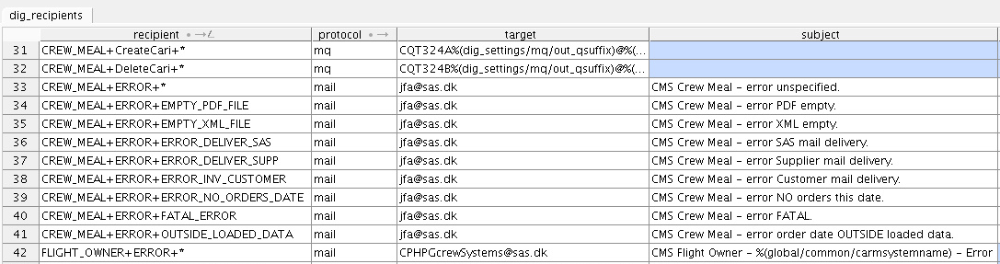

   Dig_receipients table used by UserConfigurableDispatcher.

**Example**: The crew meal error EMPTY_PDF_FILE error (identified by CREW_MEAL+ERROR+EMPTY_PDF_FILE) will be sent via mail to jfa@sas.dk
since the protocol column states 'mail' and target column states 'jfa@sas.dk'. The subject of the mail will be 'CMS Crew Meal - error PDF empty'
since the subject column contains that string.
The destination address is changed by editing the target and no restart of the system is needed. It is possible to change the subject
in the same manner and it is even possible to use variables from the configuration that is found in $CARMUSR/etc/config.xml. The environment 
name (i.e. PROD or PROD_TEST) is included in the subject by adding '%(global/common/carmsystemname)'. Change the subject to 
'CMS Flight Owner - %(global/common/carmsystemname) - Error' in order to include the enviroment name for flight owner
errors e.g. 'CMS Flight Owner - PROD_TEST - Error'  
 

dig_string_patterns
"""""""""""""""""""

============= ========================================================================
Column
============= ========================================================================
recepient     A reference to the dig_recepient 
label         A label for identifying the pattern 
pattern       The pattern that will be applied. 
si            Comment
============= ========================================================================

The content of the report will tested against the pattern and the recepient will be
used if it matches. If there is no match the '*' recepient will be used.

This table is not used for type of reports, so it is normal that not all reports are
stated in the table. 

dig_protocol_set
""""""""""""""""

Contains all protocols that may be used. This table should not be changed by 
the user.

============= ========================================================================
Column
============= ======================================================================== 
protocol      Protocol name e.g. mail and mq. 
si            Comment
============= ========================================================================

dig_reporttype_set 
""""""""""""""""""

Contains all types of reports that may be used. This table is not normally changed by 
the user.

============= ========================================================================
Column
============= ======================================================================== 
maintype      Maintype, e.g. CREW_MEAL or SALARY_EXPORt 
subtype       Subtype, e.g. ERROR, CreateCari
si            Comment
============= ========================================================================

dig_reportrecepient_set  
"""""""""""""""""""""""

Contains all report recepients that may be used. This table is normally not changed by 
the user.

============= ========================================================================
Column
============= ========================================================================
reporttype    A reference to the dig_reporttype_set 
rcptype       Recepient type e.g. error desciption (EMPTY_XML_FILE) or wildcard '*' 
si            Comment
============= ========================================================================

Channel Configuration
^^^^^^^^^^^^^^^^^^^^^

In the file meal.xml the following tags define the behaviour for sending::

  <process name="meal"
    ...
    <messagehandlers>
      ...
      <messagehandler class="dig.xhandlers.UserConfigurableDispatcher"/>
      ...
    </messagehandlers>    

    <notifiers>
      <notifier category="fatal"
                class="carmensystems.dig.notifiers.mail.MailNotifier"
                host="%(dig_settings/mail/host)"
                port="%(dig_settings/mail/port)"
                sender="%(dig_settings/mail/from)"
                recipients="%(dig_settings/mail/to)"
                subject="DIG channel 'meal' fatal error" />
    </notifiers>
  <process>

The message handler dig.xhandlers.UserConfigurableDispatcher will check the channel 
name, message status, and the message description and redirect the message to the specified 
destination (e.g. mail receipient) 

Example: When an error message of type OUTSIDE_LOADED_DATE is inputted to the dispatcher it 
will be sent to 'CMOS@SAS.DK' as a mail. The subject will not be changed.   

The notfier tag is a fallback that is used for sending notifiers when unpredictable 
errors like a script crash occurs. The destination of the notifier mail are specified
in $CARMUSR/etc/dig/settings/mail.

*Note:* Fatal errors are also shown in the status message of the job table, in a
short form.

*Note:* See reference documents for details on configuring:
 * *Integration Functional Reference*, especially chapter *Setup* that describes
   where the different configuration files can be found.

Error message examples
^^^^^^^^^^^^^^^^^^^^^^

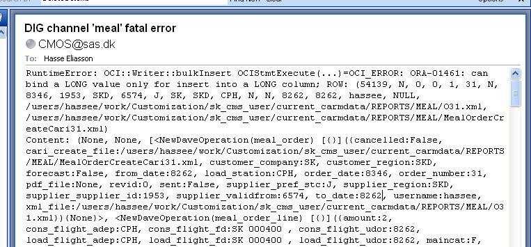

   Fatal error message example
   

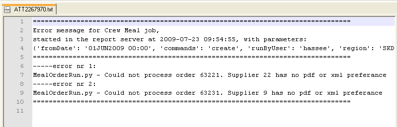

   Normal error message example.

Error message compilation
^^^^^^^^^^^^^^^^^^^^^^^^^

Below follows all error messages that can be raised by the meal report Python
script.

The following tags will be replaced in actual error messages according to:

=================== ===================================================
Tag                 Value
=================== ===================================================
<one of following>  one of the messages in the following list
<detailed reason>   error text from a lower level API
xx                  an appropriate value i.e date, order nr or flight nr
=================== ===================================================

*MealOrderRun.py* - Could not create new order/report. <one of following>

  * "The order date:xx is outside the report servers loaded data period:(xx - xx)"
  * "Customer not valid for region xx. error:xx"
  * "Customer not valid. Region xx not found."
  * "Customer not valid. Several matches for region xx."

*MealOrderRun.py* - Could not create meal_order entry for date=xx, supplier=xx,
station=xx, company=xx, region=xx
Reason is exception:<one of following>

 * "Supplier xx not valid. error:<detailed reason>"
 * "Station xx is not valid. error:<detailed reason>"
 * "Customer xx not valid. error:<detailed reason>"

*MealOrderRun.py* - Could not create meal_order_line entry date=xx, supplier=xx,
station=xx, company=xx, region=xx"
Reason is exception:<one of following>

 * "Flight (xx,xx,xx) is not valid. error:<detailed reason>"
 * "CrewCategory (xx) is not valid. error:<detailed reason>"
 * "Meal Code (xx) is not valid. error:<detailed reason>"

*MealOrderRun.py* - Could not create/send report for order xx. <one of following>"

 * "Order xx has empty pdf_file column, required by supplier xx."
 * "Cannot find pdf file for order xx"
 * "Order xx has empty xml_file column, required by supplier xx."
 * "Cannot find xml file for order xx"

*MealOrderRun.py* - Could not process order xx. <one of following>"

 * "Nothing to do. No command given in inparams:xx"
 * "Supplier xx has no pdf or xml preferance"
 * "Wrong fileTypeSuffix:xx"
 * "Could not find Order Nr xx. No data could be loaded. error:<detailed reason>"
 * "Order Nr xx has invalid supplier data.  error:<detailed reason>"
 * "Order Nr xx has invalid customer data. error:<detailed reason>"
 * "Order Nr xx has invalid orderline. error:<detailed reason>"
 * "Order Nr xx contains invalid data. error:<detailed reason>"

Description of Reports
----------------------

There are a few types of reports.

 * Forecast reports 
 * Order reports
 * Update reports
 * Booked order report
 
The first three are created automatically while the booked order report is available from in Studio
to check which orders that have been created and sent for a certain leg. 

Report generation
^^^^^^^^^^^^^^^^^

Forecasts are generated one time every month after schedule release and covers
next month. Orders are generated every day and cover the following day. The updates
are generated every 10th minute and handles flights a few hours ahead.

It is also possible to generate forecasts and orders manually through a user
interface, described in :ref:`manual_runs-label`.

Forecasts and  orders are generated for a station in a specific SAS region 
if there are flights with meal load need and there is at least one caterer.
Updates are using the same rules but the caterer must have support for updates.

Which region a flight belongs to is controlled by the database table
``meal_flight_owner table``. If the flight is not found in this table, it defaults to
the trip homebase of the crew.

Caterers have individual preferences of which format they want for meal orders
and forecasts. This is entered for each caterer in the supplier basic data
table. This table also specifies whether a caterer has support for update orders.

Forecast Reports
^^^^^^^^^^^^^^^^

Forecasts are generated in PDF and XML format. A meal forecast contains
information of the expected crew meal need for a month. An example of the
forecast PDF is shown below:

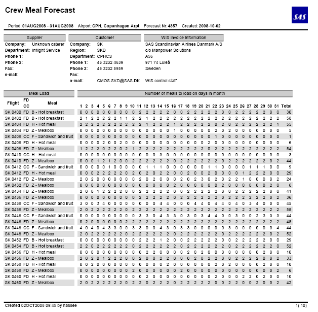

   Forecast report in PDF format

Configuration of forecast report
""""""""""""""""""""""""""""""""

The forecast report is based on Latest data, latest saved data.

The automatic forecast runs on the 22nd every month

Order Reports
^^^^^^^^^^^^^

Meal orders are generated PDF and XML format. Besides from an order XML, another
XML is generated which is used to update the CARI system.

A meal order contains the crew meals each SAS region wish to order from a
caterer a day. Below is an example of the meal order PDF:

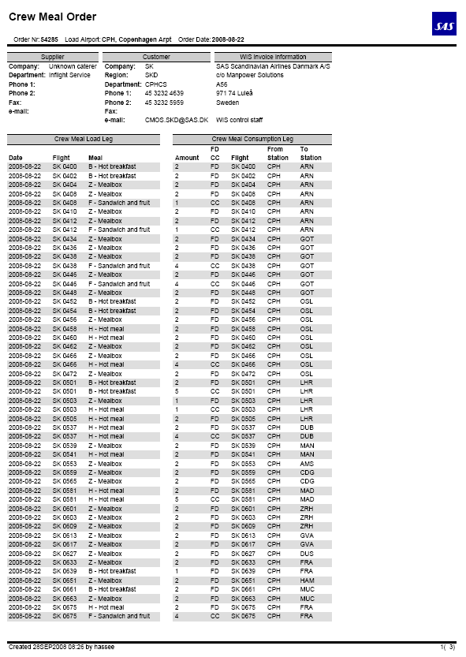

   Order report in PDF format

Configuration of order report
"""""""""""""""""""""""""""""

The order report is based on Latest data, latest saved data.

Update Reports
^^^^^^^^^^^^^^

Meal updates are generated in PDF and XML format. Besides from an order XML, another
XML is generated which is used to update the CARI system. A Telex message is also 
created and sent to the supplier.
 
A meal order contains the crew meals each SAS region wish to order for specific load
flight in the near future. The update orders only adds meals so meals order will never 
be delted. 
  
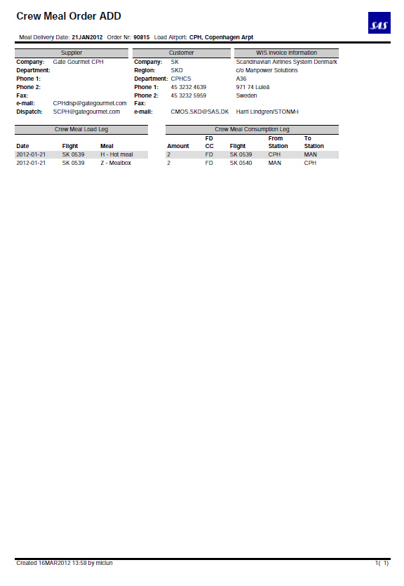

   Update report in PDF format

Configuration of order report
"""""""""""""""""""""""""""""

The order report is based on Latest data, latest saved data.

Booked Orders
^^^^^^^^^^^^^

The booked orders report is accessed by right clicking on a leg in Studio and selecting:
Reports->Ordered Meals

It shows all orders related to the flight i.e. orders that are loaded or consumed
on the selected flight. This is done by searching the database for all orders related to 
the leg. 

.. figure:: images/image051.png

   A booked meal orders report

Description of Basic Data
-------------------------

Basic data is used to feed information to the crew meal application.

It is used to:
 * Prioritize between different possible choices
 * Hold information that goes into reports
 * Decide where meals can be loaded
 * Decide for which crew it should be loaded
 * Override certain meal loads or assignments

Basic data can be modified using the :menuselection:`Basic Data Management` menu.
Another possibility is opening the Table editor directly from the Application
Launcher providing that the user has sufficient rights.

Customer
^^^^^^^^

Customer basic data are stored in the ``meal_customer`` table. In this table
contact information regarding meal orders is stored for the different SAS
companies and regions.

If there is no entry in this table no meal will be assigned for crew belonging
to that region.

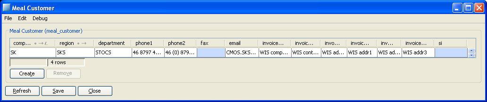

   ``meal_customer`` basic data table

Caterer
^^^^^^^

In the ``meal_supplier`` table information about all available caterers is
stored. A caterer is valid for a station and for a specified time period, i.e.
between *validfrom* and *validto* (Note: validto is not included in the range)
.
The opening- and closing-time tells at what time of day the supplier can be used.

Setting the ``pref_stc`` (preferred for service type) attribute means that this
supplier will be chosen before others for that service type. If several
different service type needs preferred for the same supplier, duplicate lines
will have to be added for each one.

The ``pdf`` and ``xml`` columns tells which formats that the supplier wishes to
recive reports in. Setting both is valid, but none will give an error when
sending.

The ``update_support`` and ``sita_address`` is used to configure update orders.
A supplier supports update orders if ``update_support`` is true and the Telex
message will be sent to the address set in the ``sita_address`` field.

For the same ``supplier_id`` all supplier specific data must be the same at ALL
times.

The supplier specific data are:
 * ``company``
 * ``station``
 * ``opening-time``
 * ``closing-time``
 * ``phone``
 * ``fax``
 * ``email``
 * ``pdf``
 * ``xml``
 * ``update_support`` 
 * ``sita_address``

If any of theses must be updated, all lines for that id must be updated, i.e.
adding a new row with the changes to the data, with a ``validfrom`` equal the
``validto`` of the updated line.

It is possible to have a default caterer if no caterer is found for a station
where meal load is necessary. The default caterer is added as a row in the
caterer table with the ``supplier_id`` *DEFAULT*. If it has a mail address the
receiver will be notified of each missing caterer when meal orders are being
generated.

*Note:* All stations must have a ``stn``, even the default station. Use one that
already has a preferred supplier, i.e. *CPH*.

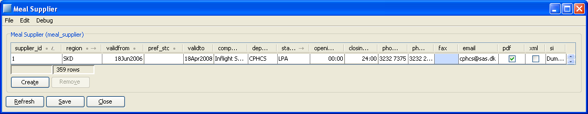

   ``meal_supplier`` basic data table

Meal Codes
^^^^^^^^^^

Meal codes are managed through two different table interfaces. First there is the
``meal_code`` table where caterer meal codes and descriptions are stored. Second
there is the ``meal_consumption_code`` table where internal meal codes, times and
dates are mapped against supplier meal codes. Both table interfaces are shown
below.

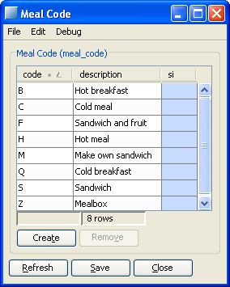

   ``meal_code`` basic data table

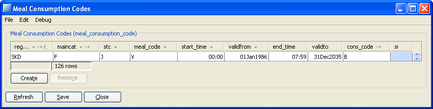

   ``meal_consumption_code`` basic data table

If an entry is valid is decided by if current date is in the interval
``validfrom`` to ``validto``.

The time of day also affects which entry is valid, by the interval ``start_time``
to ``end_time``. The interval includes the end values e.g. if there is one entry
00:00 - 07:59 the other entry should be 08:00-23:59 in order to cover the whole
day. If not all minutes of the day are covered it may result in meals not
ordered.
The local departure time of the station is used when looking up the meal code
except for ground meals where the local time of the arrival station is used. The
idea is to use the time when the meal will actually be consumed. 

Which crew that is affected of an entry is given by the combination of
``regions``, ``maincat``, ``stc``.

Flight Owner
^^^^^^^^^^^^

Each flight has a region that is responsible for meals on that flight. It is the region (customer)
that will be used when creating orders for the flight. The table `meal_flight_owner` is used to 
determine responsible region for each flight. If no region is found for a certain flight, the 
homebase of the crew that the meal will be ordered for is used instead.

 A snapshot of the table is shown below:

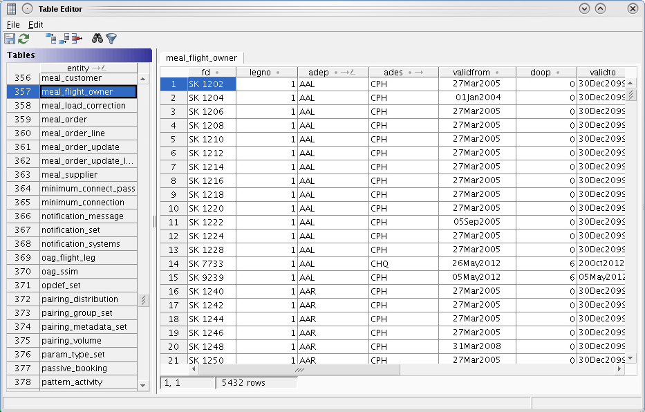

   ``meal_flight_owner`` data table

+------------+-----+----------------------------------------------------------------------------------------+
| Columns    | Key | Description                                                                            |
+============+=====+========================================================================================+
| fd         | Yes | Flight description e.g. SK 1202                                                        |
+------------+-----+----------------------------------------------------------------------------------------+
| legno      | Yes | The leg number e.g. 001                                                                |
+------------+-----+----------------------------------------------------------------------------------------+
| adep       | Yes | Departure station                                                                      |
+------------+-----+----------------------------------------------------------------------------------------+
| ades       | Yes | Arrival station                                                                        |
+------------+-----+----------------------------------------------------------------------------------------+
| validfrom  | Yes |  Start date (included in the interval)                                                 |
+------------+-----+----------------------------------------------------------------------------------------+
| doop       | Yes |  Day of operation. 0=All days, 1=Monday, 2=Tuesday etc.                                |
+------------+-----+----------------------------------------------------------------------------------------+
| validto    | No  |  End date (included in the interval)                                                   |
+------------+-----+----------------------------------------------------------------------------------------+
| region     | No  |  The responsible region e.g. SKD (originates from route sector in FIA file e.g. RSD)   |
+------------+-----+----------------------------------------------------------------------------------------+
| rs         | No  |  Not used.                                                                             |
+------------+-----+----------------------------------------------------------------------------------------+
| bap        | No  |  Not used.                                                                             |
+------------+-----+----------------------------------------------------------------------------------------+
| airdesg    | No  |  Not used.                                                                             |
+------------+-----+----------------------------------------------------------------------------------------+
| rst        | No  |  Not used.                                                                             |
+------------+-----+----------------------------------------------------------------------------------------+
| rz         | No  |  Not used.                                                                             |
+------------+-----+----------------------------------------------------------------------------------------+
| ra         | No  |  Not used.                                                                             |
+------------+-----+----------------------------------------------------------------------------------------+
| rsa        | No  |  Not used.                                                                             |
+------------+-----+----------------------------------------------------------------------------------------+
| grp        | No  |  Not used.                                                                             |
+------------+-----+----------------------------------------------------------------------------------------+
| flttyp     | No  |  Not used.                                                                             |
+------------+-----+----------------------------------------------------------------------------------------+

The table is populated automatically by a dig channel named ``flt_ownership`` and the table shall never
be edited manually. The channel looks in the directory $CARMUSR/current_carmtmp/ftp/in for files starting
with 'FIA' and then uses this file to populate the table. The file is moved to $CARMUSR/current_carmtmp/ftp/imported
afterwards. 
The channel configuration is located in $CARMUSR/etc/dig/channels/flt_ownership.xml and there is normally no 
need to edit this file. It contains where to look for the input FIA file, where to move the file when it has 
been processed, and destination for fatal errors emails. The only real configuration of the channel that is supposed 
to be done is the destination for errors with fault handling like when inconsistencies are found in the input.  
This destnation address is configurable using the recepient configuration described in :ref:`recepients-configuration-label`. 

The 'recepient' in the dig_recepient table is named 'FLIGHT_OWNER+ERROR+*', the 'protocol' is set to 'mail', 
and the 'target' is set to CPHPGScrewsystems@sas.dk by default. The 'recepient' and 'mail' shall not be changed. In
order to change the destiation of error emails, just enter the desired email address in 'target'    

A a typical e-mail looks like this:

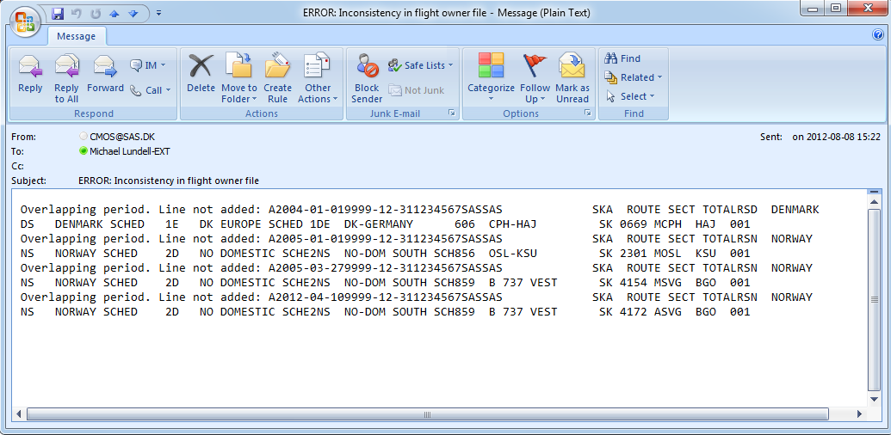

   Example of e-mail with errors detected when processing the FIA file

Correction
^^^^^^^^^^

Two table interfaces are used for making corrections to the meal allocations. The
``meal_cons_correction`` table interface is used for adding and removing meals
to/from flights.

.. tabularcolumns:: |L|L|p{9cm}|

+------------+-----+----------------------------------------------------------------------------------------+
| Columns    | Key | Description                                                                            |
+============+=====+========================================================================================+
| Flight     | Yes | If zero is set all flights between two airports are valid, i.e. it is used as wildcard |
+------------+-----+----------------------------------------------------------------------------------------+
| stn_from   | Yes | Takeoff airport                                                                        |
+------------+-----+----------------------------------------------------------------------------------------+
| stn_to     | Yes |  Landing airport                                                                       |
+------------+-----+----------------------------------------------------------------------------------------+
| maincat    | Yes |  Specifies flight or cabin crew                                                        |
+------------+-----+----------------------------------------------------------------------------------------+
| valid_from | Yes |  Start date of the validity interval                                                   |
+------------+-----+----------------------------------------------------------------------------------------+
| corr_type  | Yes | Type of correction. It can be any of:                                                  |
|            |     |                                                                                        |
|            |     |  * ``A``: Add meal to leg                                                              |
|            |     |  * ``N``: No meal for scheduled crew meal                                              |
|            |     |  * ``O``: Override only if scheduled crew meal                                         |
|            |     |  * ``S``: Supplement only on leg without scheduled meal                                |
+------------+-----+----------------------------------------------------------------------------------------+
| stc        | No  |  Comma separated list of matched mealcodes                                             |
+------------+-----+----------------------------------------------------------------------------------------+
| validto    | No  |  End date of the validity interval                                                     |
+------------+-----+----------------------------------------------------------------------------------------+
| corr_code  | No  |  Comma separated list of replacement mealcodes                                         |
+------------+-----+----------------------------------------------------------------------------------------+
| weekdays   | No  |  Valid days                                                                            |
+------------+-----+----------------------------------------------------------------------------------------+

|
|

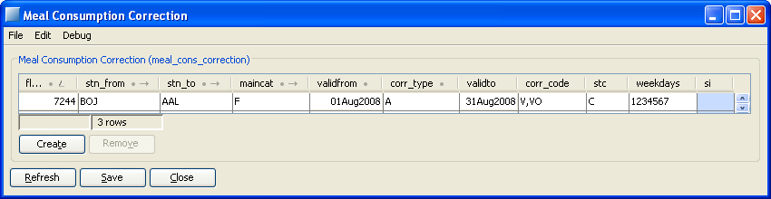

   ``meal_cons_correction`` basic data table

The ``meal_load_correction`` table interface is used to specify on which flights
meals will be loaded, as shown below:

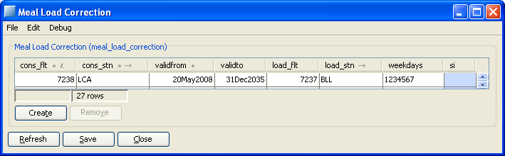

   ``meal_load_correction`` basic data table

The interval ``validfrom`` to ``validto``, sets the validity interval of the
correction.

The ``weekdays`` field decides for which weekdays the corrections shall be
applied. A number matches that day of the week, and space means that that day
shall not be matched.

*1234567* -> all days in week.
*7* -> only Sundays

``cons_flt`` and ``cons_stn`` gives which flight to match.

``load_flt`` and ``load_stn`` tells where the load should take place instead.

Airport
^^^^^^^

The ``meal_airport`` table is used to control on which airports there can be a
meal_stop.

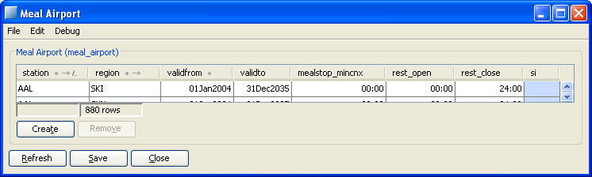

   ``meal_airport`` basic data table

The ``station`` and ``region`` fields decides if the station is valid for each
crew.

The ``rest_open`` to ``rest_close`` interval decides at what time of day meal
stops are allowed.

The ``mealstop_mincnx`` is used to see if the connection is long enough for a
meal stop.

Description of Order Data
-------------------------

.. _filtering-of-order-data-label:

Filtering of order data
^^^^^^^^^^^^^^^^^^^^^^^

The order data is filtered based on selected month that can be set using menu
:menuselection:`Order Data Management --> Change filter period`.

The selected month is initialized to the current month when the application is
started.

The actual time window of the filter is:

 * *From*: selected month - 3 months
 * *To*: selected month + 1 month

Example:
  Selecting 1 Aug will give orders from 01May to and including 30Sep.

The filter is applied on the *Order Date*, i.e. when the order was created.

*Note:* Filtering applies everywhere in the application where meal orders are used:

 * *Meal Orders form*, see below
 * *Base views of the application*, i.e. Meal Order/ Meal Forecast

Display of order data
^^^^^^^^^^^^^^^^^^^^^

Meal order data are shown in the upper pane of the form. In the lower pane order
lines will be shown, for the one selected order in the upper pane.

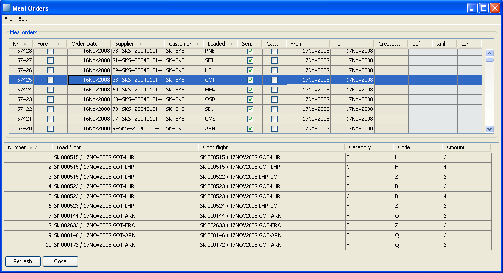

   *Meal Orders* form
