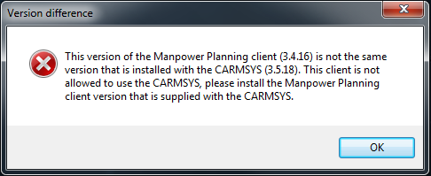
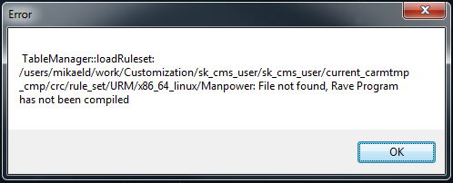
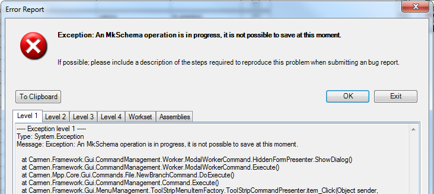
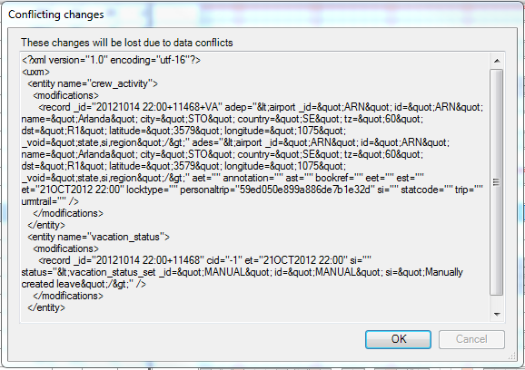
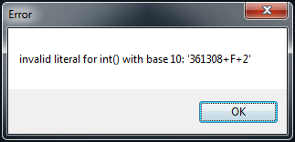
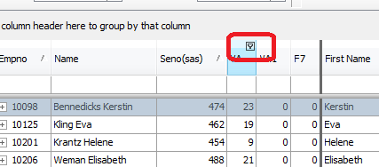
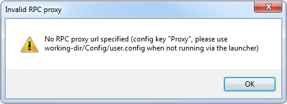
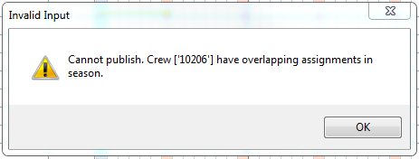
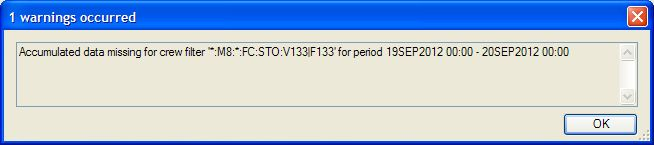

SAS JMP Troubleshooting guide
=============================

Introduction
------------

This Document
^^^^^^^^^^^^^
This guide is primarily targeted at System Administrators or Developers as solutions provided
generally needs some sort of interaction with the UNIX-machine that runs the Manpower
server-process.

Sections General, Leave and Establishment contain more hands-on solutions to some common problems
whereas sections Data-related problems and Debugging merely contains hints on where to first
start troubleshooting or give the troubleshooter a push in the right direction.

General
-------

.. _sessionserver:

Which installation is my launcher pointing to?
^^^^^^^^^^^^^^^^^^^^^^^^^^^^^^^^^^^^^^^^^^^^^^

This is handled by the SessionServer which is usually installed in
/opt/Carmen/SessionServer.<hostname>. The actual configuration is located in user/etc/systems.xml.
Example from SASTEST::

  <system name="SAS_CMS2_SP4_2_PROD_TEST">
    <CARMDATA>/opt/Carmen/CARMUSR/cms2_sp4_2_user/current_carmdata</CARMDATA>
    <CARMTMP>/opt/Carmen/CARMUSR/cms2_sp4_2_user/current_carmtmp_cct</CARMTMP>
    <CARMSYS>/opt/Carmen/CARMUSR/cms2_sp4_2_user/current_carmsys_cct</CARMSYS>
    <CARMUSR>/opt/Carmen/CARMUSR/cms2_sp4_2_user</CARMUSR>
    <CARMSYSTEMNAME>PROD_TEST</CARMSYSTEMNAME>
    <CARMROLE>Administrator</CARMROLE>
    <carmfileservlet>
      <show>REPORTS</show>
    </carmfileservlet>
  </system>

The name of the instance in your launcher should match to one of the nodes labeled <system name>.
Below it you can find the main configuration points such as CARMUSR/CARMSYS and what CARMSYSTEMNAME
is used.

I don't have a Manpower icon in my launcher
^^^^^^^^^^^^^^^^^^^^^^^^^^^^^^^^^^^^^^^^^^^
Make sure you have the required permissions. Depending on your environment this could be defined in
different files. If you don't know which, you can find out by looking for the attribute
CARMSYSTEMNAME in your :ref:`SessionServer <sessionserver>` configuration.

* @SASPROD: $CARMUSR/etc/users/PROD.xml
* @SASTEST: $CARMUSR/etc/users/PROD_TEST.xml
* @JEPPESEN: $CARMUSR/etc/users.xml

The actual roles are defined in $CARMUSR/etc/roles.xml

Error::Version difference - wrong client version
^^^^^^^^^^^^^^^^^^^^^^^^^^^^^^^^^^^^^^^^^^^^^^^^

.. _version_difference_figure:

   Error::Version difference

:ref:`version_difference_figure` is displayed if you don't have the correct version installed on
the Windows side. The client-version for Manpower is always distributed with the CARMSYS and an
.msi package is available in $CARMSYS/lib/windows/manpower.

Error::Can not connect to Model Server
^^^^^^^^^^^^^^^^^^^^^^^^^^^^^^^^^^^^^^
When Manpower cannot connect to the database it displays the following error.::

    Type: Carmen.DataGateway.Model.ModelServerConnectionException
    Message: Can not connect to the Model Server

First thing you should check is your database connection string. Depending on your environment this
could be defined in different files. If you don't know which, you can find out by looking for the
attribute CARMSYSTEMNAME in your :ref:`SessionServer <sessionserver>` configuration.

* @SASPROD: $CARMUSR/etc/db/PROD.xml
* @SASTEST: $CARMUSR/etc/db/PROD_TEST.xml
* @JEPPESEN: $CARMUSR/etc/db/default.xml

If the contents of this file looks okay you could proceed with trying to connect manually to your
database.

Error::TableManager::loadRuleset
^^^^^^^^^^^^^^^^^^^^^^^^^^^^^^^^

.. _no_ruleset_figure:

    Error - loadRuleset

:ref:`no_ruleset_figure` is displayed if you don't have a compiled ruleset available. Compile it
with the following command::

  $CARMUSR/bin/admin/compileRulesets.sh cmp

.. _logs:

I need to look at logfiles, where can I find them?
^^^^^^^^^^^^^^^^^^^^^^^^^^^^^^^^^^^^^^^^^^^^^^^^^^
**Manpower logs - $CARMUSR/current_carmtmp_cmp/logfiles -** Generally useful if you are looking for
raised exceptions inside Manpower and the likes.

**SessionServer logs - /opt/Carmen/SessionServer.<hostname>/logs**

**Migration logs - $CARMUSR/data/migration/<VERSION_NO>/migration_logs_<DATETIME> -**
Migration-scripts have been located in $CARMUSR/data/migration/<VERSION_NO> from CMS2SP3.2 and
forward. Scripts should have been logging output to above mentioned directory from CMS2SP4.2 and
forward.

Error::Exception: An MkSchema operation is in progress
^^^^^^^^^^^^^^^^^^^^^^^^^^^^^^^^^^^^^^^^^^^^^^^^^^^^^^
.. _mk_schema_lock:

    Exception - An MkSchema operation is in progress

When doing changes to a schema definition using MkSchema the schema will be locked and will not
accept any incoming transactions :ref:`(such as a save operation)<mk_schema_lock>`. This locking
can be done from the oracle enterprise manager as well where it is also possible to unlock it. At
SAS, there is also a command available for this::

    $CARMUSR/bin/cmsshell
    MkSchema -c oracle:<adminusr>/<password>@<host>/<service_name> -s <schema_name> -U

Conflicting changes
^^^^^^^^^^^^^^^^^^^
.. _conflicting_changes:

    "Conflicting changes - These changes will be lost due to data conflicts"

When many users (or one user with many sessions open) are saving changes to the database
simultaneously there are a few basic changes that can go wrong. These include:

* Create an already existing entity

* Remove a non-existing entity

* Edit a non-existing entity

An example of where this could happen is when the same vacation for one crew was published in two
different Manpower sessions. If both sessions are saved, two identical queries to create the entity
that represent that the crew is published will be sent to the server. This will not be allowed for
whichever session tries to save/merge last and the user will be presented with a dialog similar to
:ref:`Conflicting changes<conflicting_changes>`. All conflicting changes will be displayed in this
dialog and when pressing OK be dropped to be handled manually. This is not a problem if the
conflicting changes was exactly the same as the ones already saved. However, in case a conflicting
leave-object was created with different end-dates, that conflict would have to be resolved manually
afterwards. The conflict message can be copied and pasted into a textfile.

If the user pressed OK and later needs to look at the changes of that scenario, the scenario is
still accessible in $CARMDATA/Manpower/scenarios/<schema_name>. It will be commented out by a leading
hash-sign (#). A scenario consists of changes relative to a revision and is quite readable. If the
hash-sign is removed from the scenarios file-name, it will be possible to open the scenario from
inside Manpower. Trying to merge it again however will lead to lots of merge-conflicts as all
modification it tries to do have already been made.

Error::invalid literal
^^^^^^^^^^^^^^^^^^^^^^
.. _scenario_file_error:

    Error::invalid literal

:ref:`scenario_file_error` can be displayed if there is a problem with one of the scenario
files. This error have been seen if there was any swap-files (from e.g. vim) inside
directory $CARMDATA/Manpower/scenarios/<schema_name>

The filenames we know are allowed is:

* <scenario_name>.scen
* <scenario_name>.scen.backup
* <scenario_name>.lock
* <scenario_name>.lock.info

No revision created on 16/MM/YYYY
^^^^^^^^^^^^^^^^^^^^^^^^^^^^^^^^^
A revision is scheduled to be created on the 16th every month by scheduled command
**CMD_CREATE_REVISION**. If the expected revision does not exist you could try executing the
command manually in the CARMUSR to find potential problems with it::

    bin/manpower/cmp_revision.sh

If the output doesn't seem to indicate any errors you could continue by checking the current
configuration of scheduled commands. These can be found in **etc/sysmond/crontab.xml** and
definitions of all commands are available in **etc/sysmond/tasks.xml**.

If you want to verify that the scheduled command is correctly defined you could try executing it
manually via sysmond by running::

    $CARMUSR/bin/cmsshell
    sysmondctl at CMD_CREATE_REVISION timespec='now'

Filtering gets stuck by writing in column head
^^^^^^^^^^^^^^^^^^^^^^^^^^^^^^^^^^^^^^^^^^^^^^^
.. _filtering_stuck:

    Filtering freezes

Reported in JIRA SASCMS-4496. The workaround for this issue to click on the
:ref:`funnel-shaped<filtering_stuck>` button in the header-field. This should unlock the frozen
filter in for example a Leave view or Crew view in Manpower.

ModelError: GenericEntity::getReferers(): Referers are disabled
^^^^^^^^^^^^^^^^^^^^^^^^^^^^^^^^^^^^^^^^^^^^^^^^^^^^^^^^^^^^^^^

Manpower uses a feature of miradors table-manager API called referers. If not activated for a
specific table and field the following error will be raised::

  File
  "/users/annl/work/Customization/sas_cms2/sk_cms_user.hg/current_carmsys_cmp/lib/python/carmensystems/manpower/private/training/publisher.py",
  line 1156, in cloneNewEntry
      for entry in crew.referers(tablename, 'crew'):
      ModelError:  GenericEntity::getReferers(): Referers are disabled

In this case the tablename was "crew_qual_acqual". The definition of this table is done in
**data/config/manpower.xml** and looked as follows::

  <table name="crew_qual_acqual" load="true">
    <ref name="acqual"/>
  </table>

Referrers for this table was activated for column "acqual" but not for column "crew". We could
add it with the following change::

     <table name="crew_qual_acqual" load="true">
       <ref name="acqual"/>
  +    <ref name="crew"/>
     </table>

.. _no_config_section:

Error::Invalid RPC proxy
^^^^^^^^^^^^^^^^^^^^^^^^
.. _no_config:

    No client configuration file present

The Manpower-client requires a configuration-file in order to start. If it is not given, the error
:ref:`Invalid RPC proxy<no_config>` will be presented to the user. This configuration-file should
be located under **<client_installation_directory>\\Config\\user.config** where
**C:\\Program Files\\Jeppesen\\Jeppesen Manpower** is the default installation directory suggested
by the Manpower client installer.

A default configuration-file is not provided with the CARMSYS. Example configuration::

  <?xml version="1.0"?>
  <!--
   Use for testing purposes; place in working-directory/Config (ie. "bin/Debug/Config"
   or "C:\Program Files\Jeppesen\Carmen Manpower\Config") to enable overrides.

   Production config is stored in manpower.xml and the client is supplied with
   the Proxy setting from the launcher; the remaning config is then fetched from
   the servers various manpower.xml and manpower.user.xml files.
  -->

  <configuration>
    <setting name="Proxy" value="http://kagau:6709/RPC2"/>
    <setting name="AskPortNumber" value="true"/>
    <setting name="ShowDebugMenu" value="true"/>
    <!-- Cache xml-layouts in client -->
    <add key="CacheLayouts" value="false"/>
    <!-- Automatically reload report source before generating reports -->
    <add key="AutoReloadReports" value="true"/>
  </configuration>

Error trying to open any Manpower workset
^^^^^^^^^^^^^^^^^^^^^^^^^^^^^^^^^^^^^^^^^
When open any Manpower workset you get this error.::

    Fatal Error:Unable to cast object of type 
    'Carmen.Framework.Mapper.FieldMappings.FieldMapping' to type 
    'Carmen.Framework.Mapper.FieldMappings.FieldRelationMapping'

The reason could be due to a filtering problem in table **crew_filter_user**. Use the standalone 
table-editor to remove the records for the problematic user in table **crew_filter_user**,
then try to open Manpower again.

Leave
-----

Assigned vacation grey and impossible to interact with
^^^^^^^^^^^^^^^^^^^^^^^^^^^^^^^^^^^^^^^^^^^^^^^^^^^^^^
The leave-module uses the definition "assigned value nodes" in **data/config/manpower.xml** to
determine what activities that the user should be able to interact with in the Leave view. This
configuration also includes what vacation codes should be possible to choose from when
creating/editing leave (leave code nodes) and where to get limit from (limit value nodes)::

    <module name="carmensystems.manpower.private.leave.leave" load="true">
      <setting name="leave code nodes" value="AUTO, VA, F7, VA1, VAD, VAH, VA1D, VA1H"/>
      <setting name="limit value nodes" value="Activity___VA-F7"/>
      <setting name="assigned value nodes" value="VA, F7, VA1, VAD, VAH, VA1D, VA1H"/>
    </module>

Publish
^^^^^^^
.. _publish_overlapping:

    Cannot publish - overlapping assignments

Before publishing vacations Manpower will check for overlapping activities. If overlaps are found
:ref:`an error message<publish_overlapping>` will be displayed notifying the user of which crew
failed the check. The user could at this point choose to publish only crew without overlaps by
marking all crew (CTRL+a), CTRL+left-clicking the crew with overlaps to unmark them and press Leave
-> Publish Vacation Assignments For Selected Crew.

From here the user could proceed with resolving remaining overlaps manually. In some cases it might
be possible to resolve the overlap inside Manpower by removing or editing one of the overlapping
leave-objects. If this is done, the user needs to manually publish the changes by marking the crew
and pressing Leave -> Publish Vacation Assignments For Selected Crew.
 
If it is not possible to remove/edit leave-objects, overlaps needs to be resolved manually in
pre-studio (or the Planned Activities view inside Manpower once it is delivered). Pre-studio will
automatically publish changes done to the roster. If the open Manpower session was run on master
(not in a scenario) it is possible to get the changes into the open Manpower session by pressing
save in pre-studio and running "Refresh From Database" inside Manpower. For the Planned Activities
view, this would work for scenarios as well.

Establishment
-------------

Accumulated data missing for crew filter
^^^^^^^^^^^^^^^^^^^^^^^^^^^^^^^^^^^^^^^^
.. _accumulation_missing:

    Accumulated data missing for crew filter

If accumulation fails a warning message will be displayed at the top of the establishment. The
logfiles are located in **$CARMUSR/current_carmtmp_cmp/logfiles**.

Each night there are a number of logfiles produced. Some files are called accumulate*F*20120920*,
date indicating when it was run, F indicating it was for FD. They include all establishment and
balance accumulation done for a certain time period for all current crew groups. Establishment data
is checked one year back, balance data is checked both one year back and half a year ahead. There
are also some files called accumulate_new_filters*F*20120920* which are created for newly added crew
groups.

The accumulation is performed by scheduled command called **CMD_ACCUMULATE** and takes quite a
while to perform. If you wish to verify and look at the output, it should be possible by issuing::

    $CARMUSR/bin/cmsshell
    bin/accumulators/accumulators.sh

If the output doesn't seem to indicate any errors you could continue by checking the current
configuration of scheduled commands. These can be found in **etc/sysmond/crontab.xml** and
definitions of all commands are available in **etc/sysmond/tasks.xml**.

If you want to verify that the scheduled command is correctly defined you could try executing it
manually via sysmond by running::

    $CARMUSR/bin/cmsshell
    sysmondctl at CMD_ACCUMULATE timespec='now'

New activity codes can't be mapped in Hierarchy Manager
^^^^^^^^^^^^^^^^^^^^^^^^^^^^^^^^^^^^^^^^^^^^^^^^^^^^^^^
When adding new task-codes to table **activity_set** they are not directly visible from
Establishments Hierarchy Manger. Manpower will instead use the task-codes available in table
**est_task**. There is no GUI available for adding entries into this table so this have to be
done from a table-manager. The rows that you should add in est_task looks like this:

==== ======== ================== ======= ========
code cat      taskgroup          si      calcnode
==== ======== ================== ======= ========
MT8  C (or F) <taskgroup wanted> <empty> <empty>
UF1  C (or F) <taskgroup wanted> <empty> <empty>
==== ======== ================== ======= ========

Now it is possible to map these new tasks in the Hierarchy Manager. The calcnode column should
be left empty as it will be modified by the Hierarchy Manager.

What node in the hierarchy is activity-code X mapped to?
^^^^^^^^^^^^^^^^^^^^^^^^^^^^^^^^^^^^^^^^^^^^^^^^^^^^^^^^
There is a report available for reverse-lookup on all activity-codes and which nodes they are
mapped to in the hierarchy. Generate it as follows:

* Open any establishment view

* Run command Establishment -> Generate Establishment Report

* Choose report name **map_establishment_tasks**

The Pairing-driver doesn't show the correct values
^^^^^^^^^^^^^^^^^^^^^^^^^^^^^^^^^^^^^^^^^^^^^^^^^^
Manpower uses a table called pairing_volume to pick up exported pairing data. In that table, it
will only look for rows with field **drivername** set to the same name as the driver. At SAS the
pairing driver is named **d-Prod Pairings**. As this field comes from a free-text field in the
Pairing application when exporting the data it is possible to set this to something else. If data
in the pairing driver is missing, make sure to check that the field drivername is set to the
correct value.

Another problem have been that Manpower planners have done conflicting changes to the Pairing
Distribution without being aware of it. It is possible to make sure it is configured as expected
under Establishment -> Establishment Config -> Pairing Distribution -> Click tab Pairing
Distribution.

Data-related problems
---------------------

Loose references, missing expected data
^^^^^^^^^^^^^^^^^^^^^^^^^^^^^^^^^^^^^^^

.. _modelserver_errors:

ModelError
""""""""""
When the server-side process tries to access entities with loose references or tries to lookup a
non-existing entity the table-manager API usually raises a **ModelServer** error.

* **EntityNotFoundError** - the entity the server tries to access does not exist.
 
* **ReferenceError** - the server tries to follow a reference to a non-existing entity.

In order to work around these problems it could be an alternative to try and restore the missing
data through a :ref:`table-editor<table_editor_standalone>`. If the source of the error is not
obvious from the error-message a good source of information regarding the error is (conditional)
breakpoints and stepping through code execution in :ref:`pdb<pdb>`.
 

System.NullReferenceException
"""""""""""""""""""""""""""""
This usually means that the Manpower client encountered an entity in the datamodel with a reference
to another non-existing entity. Similar to a :ref:`ModelServer error<modelserver_errors>` on the
server-side process but on the client-side application instead. This is problematic as the client
will generally not display which table or row caused the problem. If possible, some tables could
be checked for loose references by the method explained in section :ref:`pdb<pdb>`. For example, if
the error occurs when a crew is expanded, you could check tables used for those detailviews. These
include tables bid_leave_vacation, bid_leave_other, leave_transaction or account_entry. When
guesswork doesn't cut it, the best way to find out is to run the Manpower client through Visual
Studios debugger.

.. _table_editor_standalone:

Who and what application created/edited an entity
^^^^^^^^^^^^^^^^^^^^^^^^^^^^^^^^^^^^^^^^^^^^^^^^^
Audit trail is available by running a standalone table-editor. With the right permissions users
should have this available from the launcher. If not it can be started by the command
**$CARMUSR/bin/testing/tableeditor_standalone.sh**. Double-clicking on a row in this editor will
provide the editing history for that row (commitid, user, timestamps). In case a row was
removed or primary keys changed, history for the row will not be accessible from the standalone
table-editor. sqlplus/sqldeveloper can provide further history for removed entities but that would
require knowledge about SQL and DAVE's internal structures.

.. _table_editor_manpower:

Can I access a table-editor from inside Manpower?
^^^^^^^^^^^^^^^^^^^^^^^^^^^^^^^^^^^^^^^^^^^^^^^^^
This is available from the debug menu by the command Help -> Debug -> Table Editor. However, this
requires that the debug-menu is enabled (see section :ref:`enable_debug_menu`). Note that only data
visible to Manpower is available in this table-editor which is not all tables or content of tables
in the CMS-database. Read more about that in section :ref:`data_difference_standalone_manpower`.

.. _data_difference_standalone_manpower:

Some data is available in a standalone tableeditor but not in Manpower's
^^^^^^^^^^^^^^^^^^^^^^^^^^^^^^^^^^^^^^^^^^^^^^^^^^^^^^^^^^^^^^^^^^^^^^^^
When Manpower first starts to load data in order to open a workset, filters are applied to most
tables. These filters are called dave-filters and limit the amount of data that has to be loaded
into the server-process based on properties such as workset start/end, cabin/cockpit etc. The
definitions of these filters can be found in table dave_entity_select. Filters that Manpower use
have selection set to mppcategory or mppperiod for category and period filtering respectively. This
guide will not go further to describe the layout of filtering but it is good to know that this kind
of filtering is done at least.

Manpower will also only load tables it is configured to use. Some of this configuration is done in
the CARMSYS while SAS-specific tables are configured in **$CARMUSR/data/config/manpower.xml**.

Debugging
---------

.. _enable_debug_menu:

How do I enable the Help -> Debug menu?
^^^^^^^^^^^^^^^^^^^^^^^^^^^^^^^^^^^^^^^
The debug-menu will be available in the Manpower client in he Help-menu if the client configuration
file (see section :ref:`no_config_section`) contains the line::

  <setting name="ShowDebugMenu" value="true"/>

At SAS, the Manpower-client is served as a Citrix Virtual Appliance which is configured to have the
Help -> Debug menu disabled. In order to access it from the launcher, the configuration for the
Citrix Virtual Appliance needs to be changed. The other solution would be to install a
Manpower-client in a local Windows environment and connect to a Manpower server-process started
from a shell.

.. _pdb:

PDB
^^^

When SAS Manpower has the :ref:`debug-menu enabled<enable_debug_menu>` the command Help -> Debug ->
Toggle pdb Debug is available. If the user started the Manpower server-process from a shell (as
opposed to the launcher) a debug-prompt will be presented there. From here, it is possible to add a
breakpoint (including a conditional statement if desired) where the error occurs to get access to
global/local/instance variables as well as a possibility to evaluate functions, do assignments and
step through code execution.

The debug-prompt also has a handle to a python Workset object which holds a method to return a
table-manager. This could be used as follows to look for loose references in table
bid_leave_vacation::

  (pdb): tm = workset.getTM()
  (pdb): # Find any loose reference in bid_leave_vacation to bid_leave_general
  (pdb): # by trying to access that reference for all entities in
  (pdb): # bid_leave_vacation
  (pdb): for e in tm.table('bid_leave_vacation'): e.bid

.. _rave_eval:

Rave Eval
^^^^^^^^^
There are some possibilities to evaluate rave variables/functions from inside the SAS Manpower
client if the :ref:`debug-menu is enabled<enable_debug_menu>`. This is limited to the crew-level,
so trip-level evaluation is currently not possible from the debug-menu. The command is available
from Help -> Debug -> Rave Eval. It will require the user to input a crew, and the rave-variable or
function to be evaluated.  The result will be printed to stdout or to the :ref:`mirador
log-file<logs>` if mirador (the Manpower server-process) was started with the --watchdog option.

If needed to evaluate rave variables/functions on a trip level, the best way is usually to add a
python routine that iterate over certain trips and print the variables/functions for them. We do
not cover that here however.

