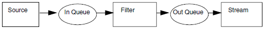
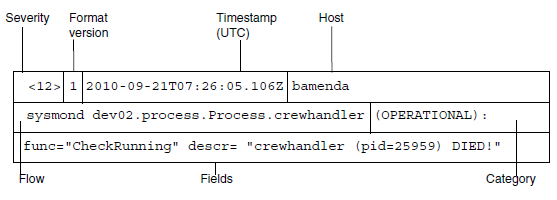

.. _carmlog:

CarmLog
=======
CarmLog is a family of components to support logging of application events
A log event is a change of program state in the running system, uniquely
identifiable, conveying information.

The following components are available:

* CarmLog API
* CarmLog Server

The CarmLog Server component provides central storage of the data logged
by the applications. The component also allows for retrieval of the stored data
for manual analysis. Each event is tagged with various mandatory information, for example time stamp, severity and category and optional data as for
example detailed program instructions and information about the environment. Whether the event statement is logged or not depends on the momentary configuration.
Each application is responsible for configuration of CarmLog behaviour.
Even if the application does not directly use CarmLog it must set up CarmLog configuration if any of its indirect dependencies uses CarmLog. Other
features as output, aggregation are the responsibilities of CarmLog.

This chapter contains the following sections:

* :ref:`carmlog.configuration_carmlog`
* :ref:`carmlog.configuration_carmlog_server`
* :ref:`carmlog.using_carmlog_and_carmlog_server`

.. _carmlog.configuration_carmlog:

Configuration CarmLog
---------------------
Common Configuration is used to configure CarmLog itself.

To know where each log entry comes from, you have to specify configuration
for CarmLog for each component in the Jeppesen CMS system. To describe
what the log information is concerning, a severity (Log level) and log category needs to be specified.

For a component, you can configure CarmLog on global, program, or process
level. Also, a flow name and output location has to be specified. Flow is
defined as the event source identifier. If no CarmLog settings are specified for
a process, the CarmLog configuration settings on program level are used. To
set specific settings for a process, copy the settings defined on program level
and add settings specific for the process. Configuration of CarmLog on the
global level is done in the configuration files in ''system/config/global/''.

Configuration elements
^^^^^^^^^^^^^^^^^^^^^^
A ``<carmlog>`` tag must be present under the ``<process>`` tag or under the
``<program>`` tag (one step above) or under the ``<global>`` tag.

It is possible to specify CarmLog configuration under all three tags. CarmLog
will first search for configuration at process level, then the program level and
finally the global level. If the ``<carmlog>`` tag is not found at all an exception is
thrown.

The CarmLog configuration has two parts: loglevels and templates:

loglevels
+++++++++

* ``carmlog/loglevels/flow`` defines log level (Severity) per flow tag.
* ``carmlog/loglevels/flow/@name``. "." equals the root in the flow tag tree.
  If no configuration is specified for ".", root gets INFO as log level.
* If no configuration is specified for a flow, it gets the log level of its parent.
  All flows will have "." (process name) as root.

templates
+++++++++

* ``carmlog/templates/flow`` defines context info per flow in ``carmlog/``.
* ``carmlog/templates/flow/appender@class`` specifies the log message
  destination. A message will be sent to all configured appenders for a specific flow and its parents. An appender must be configured for a flow or in
  any of its parents.
* ``carmlog/templates/flow/context/ifield@name`` specifies a predefined field (any of Fields) to be part of the log message for the specified
  *Log level* (Severity) and *Log category*. To specify fields for the flow to be
  used for categories or all log levels defined in ``carmlog/loglevels/flow``
  use '\*'. Fields will be inherited from their parent if no fields are specified
  for the flow. If fields are specified, parents fields will not be used. To not
  use any implicit fields, specify an empty context tag, no fields will then be
  logged for that logger with the specified log level and category for that context.

  .. admonition:: Example
      
     This CarmLog configuration illustrates the dependency between the
     templates and loglevel sections. In this example, for ``carmlog/loglevels/flow/@name`` ".",
     severity is set to ``INFO``. This implies that for all flows defined in the templates section,
     the following log levels will be reported: ``INFO``, ``WARN``, ``ERROR``, and ``FATAL``.

     In ``carmlog/templates/flow``, context info per flow is defined and its
     behaviour ".", is inherited from ``carmlog/loglevels/flow/@name`` ".".
      
     In this case, the ``templates`` section contains two appenders. For the
     ``StdoutAppend`` appender, the first ``context`` describes default behaviour, *
     looks up the set behaviour in ``carmlog/templates/flow/"."``, which in its
     turn looks up the set behaviour in ``carmlog/loglevels/flow/@name``, ".".
     This means that for log levels ``INFO``, ``WARN``, ``ERROR``, and ``FATAL``, the lines
     field is specified to be part of the log message.
     The second ``carmlog/templates/flow/context/ifield@name`` describes
     the exception: for log level ``WARN``, the ``src`` field is specified to be part of the
     log message instead of the ``lines`` field.
      
     ::

       <carmlog>
           <loglevels>
               <flow name="." level="INFO" />
           </loglevels>
           <templates>
               <flow name=".">
                   <appender class="FileAppend"
                             filename="${CARMTMP}/logfiles/logserver/
                             carmlog_${HOST}"
                             maxSizeKb="10000" />
                   <appender class="StdoutAppend" />
                   <context level="*" category="*">
                       <ifield name="func" />
                       <ifield name="lines" />
                   </context>
                   <context level="WARN" category="*">
                       <ifield name="func" />
                       <ifield name="src" />
                   </context>
               </flow>
           </templates>
       </carmlog>

.. _carmlog.log_level:

Log level
---------
To describe what the log information is concerning, a severity (Log level)
must be specified. The following log levels are used in decreasing order of
severity:

.. note::
   The existing syslog tools used in most major \*nix distributions today adhere
   to the BSD syslog format, see http://tools.ietf.org/rfc/rfc3164.txt. To be compatible with these, the default output format is similar in CarmLog. BSD
   Header start values are mapped to CarmLog log levels.

===== ================ ========================================================================================================================================================================================================================================
Level BSD Header start Description
===== ================ ========================================================================================================================================================================================================================================
FATAL <10>             Severe errors that will presumably lead to application termination. Expect these to be immediately visible for an administrator.
ERROR <11>             Other runtime errors or unexpected conditions, might still allow application running and can be acceptable in testing environments.
WARN  <12>             Potentially harmful situations or unexpected events. Only acceptable in production systems if the ramifications are expected.
INFO  <13>             Highlights application progress, like configurations used and successful completion of critical operations.
DEBUG <14>             Fine grained info that helps to examine details of elements processed. This can be used to find out which data is used in the operations. This setting will have some impact on system performance.
TRACE <15>             Higher grained than debug, used by developers for troubleshooting and diagnostics. Detailed information about program execution. This setting will significantly affect system performance, and in some cases, can have a severe impact.
===== ================ ========================================================================================================================================================================================================================================

The configured log levels can be verified with the following command run from the $CARMUSR directory:

``bin/admin/xmlconfig.sh carmlog/loglevels/flow@level``

.. _carmlog.log_category:

Log category
------------
To describe what the log information is concerning, a log category must be specified as one of the following:

============= ==============================================================================================================================================
Level         Description
============= ==============================================================================================================================================
PERFORMANCE   Generally; use of resources. For example execution times per command, system time, number of database connections used and memory consumption.
CONFIGURATION Which parameters are inputted and what are their values? How does that same value change during start up?
OPERATIONAL   Outstanding requests, uptimes, logins/logouts, abrupt session termination, total number of users, describing program progress.
============= ==============================================================================================================================================

Override default configuration with ``CARM_PROCESS_NAME``.
The configuration is identified through the process name. If the process name
is not known by the component the default configuration is used. The default
configuration is setup to log to stderr with some pre-set log levels (see Api
documentation for more information). It is also possible to override the
default configuration, in this scenario an environment variable named
``CARM_PROCESS_NAME`` must be set up with the process name to be used. Thus
the process name exist in the configuration file with valid CarmLog configuration.

.. _carmlog.implicit_fields:

Implicit fields
^^^^^^^^^^^^^^^
The following implicit fields can be activated in CarmLog:

=================== ============================================================================================================
<ifield name="XXX"> Description
=================== ============================================================================================================
func                Name of function or method from which the log is generated.
lines               To enable added lines (hanging lines) to be visible in the log. Log added by *line()* or *lines()* function.
src                 Name of the source file where the message was produced and on which line number.
procName            Name of the current process.
threadName          Name of the thread executing.
procUser            Name of the user of the running process.
procMem             Amount of memory used in the Java virtual machine.
procID              Numeric ID of the running process.
osLoad              Total CPU load on host.
=================== ============================================================================================================

Configuration example
---------------------
The example code is part of the common configuration of Sysmond.

Example::

  <programs>
   <program name="sysmondpgm">
    <process name="sysmond_ms01">
     <carmlog>
      <loglevels>
       <!-- general log level for program (ANYSEVERITY, FATAL, ERROR, WARN, INFO, DEBUG, TRACE) -->
       <flow name="." level="WARN"/>
       <!-- Specified log levels for different functions (areas) -->
       <flow name="sysmond.HA" level="TRACE"/>
       <!-- Area: log level for High Availability -->
       <flow name="APing" level="TRACE"/>
       <!-- Area: APing -->
       <flow name="task.Action" level="TRACE"/>
       <!-- Area: Tasks -->
      </loglevels>
     <templates>
      <flow name=".">
       <appender class="FileAppend" filename="${CARMSYS}/tmp/smd_${HOST}.log"/>
       <context lev="*" cat="*">
        <ifield name="func"/>
       </context>
      </flow>
     </templates>
     </carmlog>
    </process>
   </program>
  </programs>

.. _carmlog.configuration_carmlog_server:

Configuration CarmLog Server
----------------------------
The CarmLog Server component provides central storage of the data logged
by the applications. In the configuration for CarmLog API it must be defined
that the log output should be directed to a Tcp port. This output is then collected with the CarmLogServer (Source in figure below). The output information can then be filtered (Filter in figure below) and redirected to a file,
another tcp port, stdout or stderr (Stream in figure below).

   Carmlog server workflow for a log item

Everything from a source is filtered with a filter and redirected to a stream. It
is possible to have several sources and filters in one log item, however only
one stream for each log item.

Configuration elements
^^^^^^^^^^^^^^^^^^^^^^
The server behaviour is defined in a config.xml file that must be supplied.
The configuration must define CarmLog API behaviour for the server as well
define how sources, filters and streams should interact. A simple configuration example can be found in the config.xml file.

The following elements must be configured:

* :ref:`carmlog.internal_logging`
* :ref:`carmlog.source`
* :ref:`carmlog.stream`
* :ref:`carmlog.filters`
* :ref:`carmlog.log_items`

.. _carmlog.internal_logging:

Internal logging
++++++++++++++++

The first part (inside ``<carmlog>...</carmlog>``) contains CarmLog API definition for internal logging by the CarmLog Server.

.. tip::
   See also :ref:`carmlog.configuration_carmlog_server`

.. _carmlog.source:

Source
++++++
The source is defined inside <sources>...</sources>, in the example the local host on port ``42042``:

Example::

  <sources>
   <source name="client_source" class="tcp" bind="127.0.0.1:42042" />
  </sources>

It is also possible to define that source should be based on the portbase
retrieved from the Config API. The log server will then lookup all defined
portbase hosts and set up a source for each of them. To define a service in the
configuration, add following to the configuration files:
Note that service name must be ``logserver_service``.

Example::

      </xxx>
  <hosts>
   <host name="someHost" hostname="someHost" portbase="61000">
    <start>logserver_process_name_here</start>
   </host>
  </hosts>
  ...
  <process name="logserver_process_name_here">
   <service name="logserver_service" hostname="someHost" protocol="tcp" nr_ports="1"/>
  ...
  Then a corresponding source can be added with (Note that no port is specified to the bind address!):
  <source name="client_source" class="tcp" bind="192.168.0.45"/>

  And to take advantage of this define CarmLog tcpappender:
  <appender class="TcpAppend" addr="192.168.0.45" />

The main advantage of setting up this configuration is if the same configuration
files is used for several hosts, and log messages should still be appended to
same IP-address (where the log server is running) but to different ports.

.. _carmlog.stream:

Stream
++++++
The stream is defined inside ``<streams>...</streams>``. In the example, a
stream with name example1 is redirected into log file ``$CARMTMP/client1.log``.

Example::

  <streams>
   <stream name="example1" class="file" path="${CARMTMP}/client1.log" />
   <stream name="example2" class="stderr" />
   <stream name="example3" class="tcp" addr="192.168.0.1:52055" />
   ...
  </streams>

Note that environment variables like ``$CARMTMP`` can be used inside the ``.xml``
file. Stream ``example2`` is redirected to stderr (could also be stdout) and stream
``example3`` is redirected over TCP-socket to host ``192.168.0.1`` on port ``52055``.

It is also possible to define that a suffix, based on the information in the log
message should be used when creating the stream file.

.. admonition:: Example
   
   Adding the following stream:
   
   ``<stream name="client_stream" class="file" path="${CARMTMP}/client1.log_" suffix="host"/>``

   will result in, if clients from two hosts named "batuna" and "placerville" are
   logging to this stream, two different files created, client1.log_batuna
   and client1.log_placerville, where all logs from batuna are found in
   the client1.log_batuna file and all logs from placerville are found in the
   client1.log_placerville file.
  
Currently supported suffixes are
 
* suffix="``host``"
* suffix="``severity``"
* suffix="``procID``"
* suffix="``flow``"

.. note::
   Using suffixed files comes at a small cost, it requires some extra string handling/checking which might affect the performance.

Rotation of log file
++++++++++++++++++++
It is possible to define that a stream file should rotate its log file at a certain
file size. Default values for every stream are ``rotate=5`` and ``maxSizeKb=10000``.

``<stream name="client_stream" class="file" path="${CARMTMP}/client1.log" maxSizeKb="100" rotate="10"/>``

where "rotate" is the number of files that should rotated to and "maxSizeKb" is how big the file is allowed to be (before rotated).

It is possible to define removalAge, and if used the last rotated file
``<filename>_old<value of rotate>`` is compressed and renamed into
``<filename>_YYYY_MM_DD_HHMMSS.gz``.

When rotated and compressed files are too old (based on value of
``removalAge``) the files are deleted. ``removalAge`` is defined in hours, see following example:

Example::

  <stream name="client1_stream" class="file" path="${CARMTMP}/client1.log" maxSizeKb="10000" rotate="10" removalAge="48"/>

  where removalAge is defined as 48 hours.

.. _carmlog.filters:

Filters
+++++++
There are three different filter types: pass, accept and drop:

* **Pass** is used when everything should be accepted and needs no further configuration.
* **Accept** must be completed with ``"<drop name=..."``.
* **Drop** must be completed with ``"<accept name=..."``.

The definition of how filters are applied is done inside ``<filters>...</filters>``.An example:

Example::

  <filters>
   <filter name="example1" policy="drop">
    <accept name="accept_flow" flow="logclient1.*" />
    <accept name="accept_flow2" flow="logclient2.someFlow" severity="ERROR" />
   </filter>
   <filter name="example2" policy="pass"/>
   <filter name="example3" policy="accept">
    <drop name="drop_flow1" flow="*startA*" />
    <drop name="drop_flow2" flow="*startB*" />
   </filter>
  ....
  </filters>

In filter ``example1`` we define a filter with "drop everything" except flow starting with "logclient1." and also flow equal to "logclient2.someFlow" and
severity is equal to ERROR.

Note that an asterisk (*) can be used as filter in the beginning and end of
string. As seen in filter example2 it is possible to set a filter that will accept
everything using the policy=pass. In filter example3 all is accepted except
for flows containing string "startA" and "startB" (note the * in the beginning and end of the string in the filter). Also note that if two filters are contradictory the log msg is accepted.

Currently it is possible to filter on the following attributes:

* flow
* severity
* category
* host
* timestamp
* version (using the ``<drop name=...>`` and ``<accept name= ...>`` statements).

.. _carmlog.log_items:

Log items
+++++++++
Inside ``<logs>...</logs>`` we combine source, filter and stream into how the
Log server should handle each logging.

Example::

  <process name="carmlog_server">
   <logs>
    <log name="client1_log">
     <source_ref>client_source</source_ref>
     <filter_ref>example1</filter_ref>
     <stream_ref>example1</stream_ref>
    </log>
   ...
   </logs>
  </process>

In this example everything from source ``client_source`` is filtered with filter
``client1_filter`` and redirected to ``client1_stream``. It is possible to have
several sources and filters in one log item, however only one stream.

.. note::
   When defining the source, filter and stream, a thread will be set up for each
   different source, filter and stream. So, defining these items should be carefully
   considered in order not to create too many threads on the system.

Configuring CarmLog server as HA service
^^^^^^^^^^^^^^^^^^^^^^^^^^^^^^^^^^^^^^^^
With the CarmLog server a better system performance is achieved. This is
because the CarmLog server is run on the Infrastructure node which has
mounted the file system ``/opt/Carmen`` directly from the local disk or SAN.

The CarmLog server is not considered as a critical part of the CCMS as logging to
``/opt/Carmen`` can occur on each CCMS Application server. But the boost in
performance it gives makes it to an important part of the system. This is the
main reason to why the CarmLog server needs to be available and to be run under the Cluster framework.

.. _carmlog.using_carmlog_and_carmlog_server:

Using CarmLog and CarmLog Server
--------------------------------

Starting CarmLog Server
^^^^^^^^^^^^^^^^^^^^^^^
The CarmLog Server is started manually by executing the ``carmlog_server`` binary file.

Log entries
^^^^^^^^^^^
Log entries are configured in the configuration file.
All log entries start with ``<loglevel>ver dateTtimeZ host flow(category)"``, description of the elements:

=============== ============================================ =============================================================
Element         Description                                  Format
=============== ============================================ =============================================================
``<loglevel>``  See :ref:`carmlog.log_level`                 Number
``ver carmlog`` Version CarmLog                              Number
``dateTtimeZ``  UTC time                                     ``YYYY-MMDDTHH:MM:SS.msZ``
``host``        host name of the current logging client      String
``flow``        flow name of the current logging client flow String
``(category)``  See :ref:`carmlog.log_category`              String (``PERFORMANCE``, ``CONFIGURATION`` or ``OPERATIONAL``)
=============== ============================================ =============================================================

The remaining part of the log entry contains:

* explicit fields, such as aspect, cause, dbSession, description, operation, formatted as
  ``explicit_field_name="the value of the field as string"``
* implicit fields, such as function, thread name, user name formatted as
  ``implicit_field_name="the value of the field as string"``, see :ref:`carmlog.implicit_fields`.

   Example of a CarmLog message log entry

If ``src``, ``exceptionTrace``, or ``exceptionMsg`` are included in the log entry, they
are logged in separated lines formatted as: ``+ field_name=""``. Note that lines
are formatted as they are, see the example.

Example::

  <11>1 2010-08-23T08:20:47.596Z johndoe-laptop
  logclient1(OPERATIONAL):
  func="main" procUser="johndoe" procName="logclient1"
  procID="11356"
  threadName="mySimpleThread" descr="Exception_description"
  exceptType="Basic::Exception"
  
  <11>1 2010-08-23T08:20:47.596Z johndoe-laptop
  logclient1(OPERATIONAL):+ src="logclient.cc(201)"
  
  <11>1 2010-08-23T08:20:47.596Z johndoe-laptop
  logclient1(OPERATIONAL):+ exceptMsg="Exception_msg_line1"
  
  <11>1 2010-08-23T08:20:47.596Z johndoe-laptop
  logclient1(OPERATIONAL):+ exceptMsg="Exception_msg_line2"
  
  <11>1 2010-08-23T08:20:47.596Z johndoe-laptop
  logclient1(OPERATIONAL):+ exceptTrace="Exception_trace_line1"
  
  <11>1 2010-08-23T08:20:47.596Z johndoe-laptop
  logclient1(OPERATIONAL):+ exceptTrace="Exception_trace_line2"
  
  <11>1 2010-08-23T08:20:47.596Z johndoe-laptop
  logclient1(OPERATIONAL):+ my separate line1
  
  <11>1 2010-08-23T08:20:47.596Z johndoe-laptop
  logclient1(OPERATIONAL):+ my separate line2
