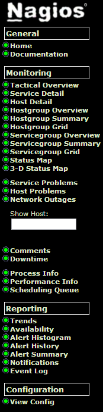
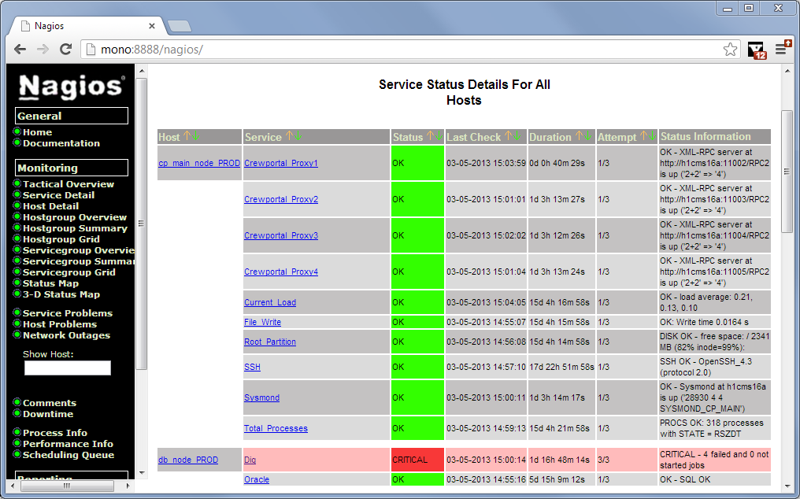
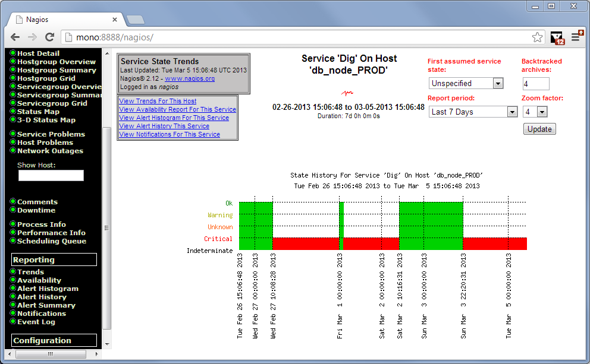

System monitoring
=================

SAS CMS2 has a monitoring system implemented that continuously checks the system health.

The purpose of the the monitoring solution is to find potential problems early.
When the system finds a problem it will notify the administrators of the problem
so that they can react early and fix the potential problems.

About
-----

The monitoring system contains logic for checking the system for a number of different
potential problems. The checks can find problems in a number of areas such as:

* Operating system
  I.e number of processes and system load.
* Filesystem and network
  This includes checks that verifies that different network hosts are reachable,
  that SSH is enabled and that the NFS file system is ok.
* Database
  Checks that Oracle is responding.
* CMS system
  A number of checks for CMS specific tasks and components exists that checks specific
  CMS functions such as Sysmond, report servers, alert generator and that specific
  report has been created.

Requirements
------------

The tool that is used for running the actual checks is Nagios which is an open
source network and infrastructure monitoring application. More information about
the tool and documentation about it can be found here: http://www.nagios.org/

In order to install the monitoring software, Nagios needs to be installed on both
the server and the nodes that is to be monitored.

Further installation instructions are provided in the generated configuration file
which is described below.

Configuration
-------------

The host that runs the monitoring server that supervises the SAS CMS production 
environment is ``h1cms96a``.

The main configuration file is ``/etc/nagios/nagios.cfg``. This file is provided
by the nagios RPM package. This file has been modified to include a SAS CMS specific
configuration file named ``cms2-nagios.cfg``.

The monitoring system configuration is generated from the actual CMS configuration
that resides it ``$CARMUSR/etc``. The monitoring configuration needs to be recreated
when there are changes made to the CMS configuraiton.

Updating configuration
^^^^^^^^^^^^^^^^^^^^^^

Use the following steps to update the monitoring configuration to reflect changes
in the SAS CMS system:

#. Stop the Nagios server (on the monitoring server)::

     root@h1cms96a > /etc/init.d/nagios stop

#. Create an new monitoring configuration file. This shall be done an a 
   infrastructure or application node::

     > cd $CARMUSR
     > ./bin/cmsshell
     > config generatemonitorconfig

   Executing the above will result in a file ``$CARMUSR/cms2-nagios.cfg`` being
   generated.

#. Copy the generated monitoring configuration file to the monitoring server.

   Example::

      root@h1cms96a > scp h1cms07a:/$CARMUSR/cms2-nagios.cfg /etc/nagios/

#. Verify that the configuration is syntactically correct::

     root@h1cms96a > nagios -c /etc/nagios/nagios.cfg

#. Restart the Nagios server (on the monitoring server)::

     root@h1cms96a > /etc/init.d/nagios start

Changing configuration values
^^^^^^^^^^^^^^^^^^^^^^^^^^^^^

The templates that are used when generating the CMS2 monitoring configuration file
resides in the ``$CARMUSR/data/monitoring/templates`` directory.

Make the appropriate changes to the files here and generate a new configuration file
according to the instructions above.

The files are self-explanary and for further information about how Nagios can be
configured, look at the Nagios web site for more documentation.

Usage
-----

Normally, there is no need to actively use the monitoring servers interface. The
server will periodically poll the system and alert the specified contacts when
something is not working.

There are however some information that the monitoring server exposes via it's
web interface such as trends for a specific host or service that is being supervisod.

Accessing the web interface
^^^^^^^^^^^^^^^^^^^^^^^^^^^

The web interface for the SAS CMS2 production environment is available at
http://h1cms96a/nagios/. In order to access the web interface from outside the
SAS network, SSH local forward can be used.

Menu
++++

When logging in to the web interface of Nagios, a navigation menu is presented
on the left hand side of the browser window.

   Nagios web interface menu

Two useful functions are:

#. ``Service Detail``
   Provides a brief list of with status of all services that are monitored by 
   the monitor system.

#. ``Trends``
   Gives the user the possibility to look at historic trends for a host or a
   service.

These functions are desribed in more detail below.

Check status of services
++++++++++++++++++++++++

The ``Service Detail`` link provides a brief list of all services together with
their current status.

   Nagios service overview

Trends
++++++

The ``Trends`` function provides a view over how hosts or services have changed
over time. It is possible to select which service or host to look at and it is
also possible to select how long timespan to generate a report for.

   Nagios trend example
