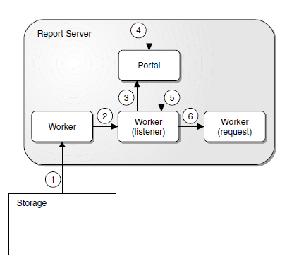

.. _system_configuration:

System configuration
====================

This chapter describes the configuration of the applications in a CMS2 system.

Planning data
-------------

Planning data is kept in plans, which are stored as instances of a database
schema using Dave. The schema is based on the CARMSYS core definitions,
UDM, with extensions in CARMUSR.

In a production environment all applications usually work with the same live
plan. However, depending on their task a user or an application may open different time windows from the plan.

Temporary files are used to send planning data to optimizers and the results
must be fetched back to the database plan.

The planning data is defined in the data_model section of the configuration.

Example::

  <data_model>
    <plan_dir>TestPlans/Tracking</plan_dir>
    <plan_path>%(data_model/plan_dir)/%(db/schema)/%(db/schema)</plan_path>
    <period_start>now_month_start+0</period_start>
    <period_end>now_month_end-1</period_end>
    <!-- CARMSYS adds 1 day... -->
    <interface name="db_node" url="%(db/connect)"/>
  /data_model>

Finding the schema/live plan
^^^^^^^^^^^^^^^^^^^^^^^^^^^^

Studio and Alert Generator need a file plan structure to locate the database
plan. Other components need the URL from the database service and sometimes also the schema name.

Shared servers can use their own ``period_start`` / ``period_end`` settings to
read a smaller time window (see program/process, program below).

Studio adds time buffers defined in the Studio resources: ``DataPeriodDbPre``
(default 28 days) and ``DataPeriodDbPost`` (default 14 days). These buffers
are needed to calculate legality (complete trips and sliding rules), but may not
be needed in a report server.

Client applications
-------------------

Client applications use the ``application namespace`` for configuration settings.

Launcher
^^^^^^^^

Launcher is the GUI client part of the Session Server. See :ref:`session_server` for information on configuration options.

Alert Monitor
^^^^^^^^^^^^^

The Alert Monitor has several configuration options that can be set and
retrieved via Common Configuration.

Localization
++++++++++++

 * ws.timezones
   Valid time zones in the format: ``<timezone id>[;<timezone id>]``
 * user.language
 * user.country
 * user.variant
   Standard Java properties for the used Locale.

If the Locale is set by the Session Server, it can be overridden by:

 * tws.language
 * tws.country
 * tws.variant

Alert Monitor can be localized to other languages through Java ResourceBundles.
There is one default and one Swedish bundle in ``trackingworkspace.jar``:

 * ``config/TWSMessageBundle.properties``
 * ``config/TWSMessageBundle_sv.properties``

The URL to a ``.po`` file with additional translations can be given by:

``tws.pourl = <url>``

Alert Server connection
+++++++++++++++++++++++

 * tws.davexmlrpc
   Alert Server URL.

Time Server connection
++++++++++++++++++++++

 * timebase.url
   Time Server URL.
 * timebase.sendinterval
   Interval in seconds for the system time to sync with the time server.
 * timebase.updateinterval
   Interval in seconds for system updates in Alert Monitor.

Launch of Studio
++++++++++++++++

 * com.carmensystems.basics.spl.user
   User used when starting a Studio instance.
 * com.carmensystems.basics.spl.host_key
   Studio host key.
 * com.carmensystems.basics.spl.command
   Start command for Studio from Alert Monitor.

Miscellaneous
+++++++++++++

 * tws.refreshrate
   Interval in seconds for refresh of alerts (default: 10).
 * tws.removetasksonexit
   Whether to completely remove all user tasks when exiting, instead of
   closing them. (default: true).
 * tws.helpurl
   On-line documentation URL.
 * browser.path
   Path to help browser in Unix.
 * tws.carriercode
   Carrier code
 * tws.task.crewid
   Task naming logic.

Editor settings
+++++++++++++++

 * tws.backgroundeditors
   Number of editors started in the background (default: 1).
 * tws.maxeditors
   Maximum number of editors that can be launched from Alert Monitor
   (default: 3) .
 * tws.openeditor
   Whether to open an editor when doing "Solve" on alerts. (default: true)

Gui
+++

 * tws.zoomtonow
   Whether to zooms to (now - zoomstart, now + zoomstop) after initial load (default: true)
 * tws.zoomstart
   Number of hours before "now" (default: -24)
 * tws.zoomstop
   Number of hours after "now" (default: 96)
 * activity.expandoverlap
   Whether to use "dynamic layout" at start up. (default: false)
 * tws.aggregatepacts
   Whether to aggregate personal activities with the same code and the
   same start time (default: false).
 * tws.shownrforonealert
   Whether to show the number 1 in front of aggregates with only one
   alert (default: true).
 * tws.shownronsummarybar
   Whether to show the number in front of the summary bar, next to the
   category name, in the gantt view (default: true).
 * tws.alerts.savechecklimit
   Limit for user confirmation before performing a massive save operation. Given in number of alerts, where 100 is the default value.
 * tws.singleclickgroupexpand
   Whether to use single click to expand resources (Categories) in the Alert Overview.

Table columns
+++++++++++++

You can configure which alert properties that should be available in the
details table and which that should be visible at start up.

The available columns is controlled by the ``tws.alert.columns.available``
property that, if set, must list all properties that should be available in the
table. The columns are displayed in the given order.

Example::

  tws.alert.columns.available=generatedtime, alertgroup,
  description, activity_name, alerttime, link_id,
  resource_name, tasks, snoozeuser, snoozeto

Categories and alert groups
+++++++++++++++++++++++++++

 * tws.treeorder
   A comma-separated list of Categories and/or AlertGroups in the
   desired sort order.

Related AlertGroups can be grouped into Categories according to:

``tws.alert.category.<AlertGroup>=<Category>``

Example::

  ...
  <tws.alert.category.OMA>Traffic</tws.alert.category.OMA>
  <tws.alert.category.CLA>CLA</tws.alert.category.CLA>
  ...

Alert icons
+++++++++++

 * tws.alert.icon.url.<AlertGroup> = <url>
   URL to the alert icon for an alert group.

Filters
+++++++

There are two types of filters:

 * LDAP filters
 * Time filters

Filters show up under the Alert Filters panel on the bottom left corner of Alert
Monitor. When a filter is active, the Alert Filters title bar switches colour to
indicate that the view is filtered.

LDAP filters use the same basic syntax as the command line

Example::

   <tws.filter.ldap.a1>(snoozefrom=*), Snooze.Snooze
   </tws.filter.ldap.a1>
   <tws.filter.ldap.a2>(!(snoozefrom=*)), Snooze.Active
   </tws.filter.ldap.a2>
   <tws.filter.ldap.b0>(|(alertgroup=OPENTIMECO)(alertgroup=OPEN
   TIMESIM)), Composition.Opentime Cockpit
   </tws.filter.ldap.b0>
   <tws.filter.ldap.b01>(alertgroup=OPENTIMECA),
   Composition.Opentime Cabin
   </tws.filter.ldap.b01>

By default there is an Alert Summary panel that displays the total number of
alerts and number of assigned and unassigned alerts in Alert Monitor. If the
time filters are configured they are presented in this panel instead. When a filter is active, the row switches colour to show that the view is filtered.

Snooze menu
+++++++++++

If the Snooze menu has been configured, it is displayed by right-clicking in
the Alert Overview.

Example::

  <tws.snooze.0>(5m), 5 min</tws.snooze.0>
  <tws.snooze.1>(10m), 10 min</tws.snooze.1>
  <tws.snooze.2>(30m), 30 min</tws.snooze.2>
  <tws.snooze.3>(1h), 1h</tws.snooze.3>
  <tws.snooze.4>(8h), 8h</tws.snooze.4>
  <tws.snooze.5>(1d), 1 day</tws.snooze.5>

.. Note::
   To filter snoozed alerts from the Alert Overview, you have to define filters in
   your configuration.

Alert searching
+++++++++++++++

The search function in Alert Monitor uses the command line interface and to
enable it you have to activate the ``tws.commandline`` property.

Rule Exception form
+++++++++++++++++++

 * tws.ruleex.columns.visible
   Comma-separated list of columns to show for alerts for which rule
   exceptions can be created.
 * tws.nonruleex.columns.visible
   Comma-separated list of columns to show for alerts for which no rule
   exception is possible.

Rave IDE
^^^^^^^^

Rave IDE is a development environment for Rave code. More information is
found in *Jeppesen Rave Reference Manual*.

Manpower client
^^^^^^^^^^^^^^^

The Manpower client is a Windows application for managing long-time planning.

XML Configuration
+++++++++++++++++

Default configuration file: ``$CARMSYS/data/config/manpower.xml``

.. Note::
   This XML file uses a Manpower-specific format that is not used by Common Configuration.

Exceed
^^^^^^

Exceed is the preferred X server for Jeppesen products. Configuration information
is found in *Jeppesen System Administrator Reference Manual*.

On-demand server applications
-----------------------------

Studio Gantt editor
^^^^^^^^^^^^^^^^^^^

Studio provides manual planning capabilities using Gantt views of the planning
data. For more information about configuring Studio, see *System Configuration Manual*.

Optimizers
^^^^^^^^^^

For configuration of the different optimizers, see the corresponding document.
For example, *Crew Pairing APC Reference Manual*.

Rave IDE server
^^^^^^^^^^^^^^^

The server component of Rave IDE. For more information, see *Tools, Rave
Reference Manual*.

Shared server applications
--------------------------

All programs in this category are started by Sysmond, the system monitoring
daemon. This section describes the configuration of these programs, including Sysmond itself.

Shared server programs use the program/process namespace for XML
settings. Process-specific settings can be defined at the program level as a
fallback.

Example::

  myprogram/mandatory_setting1 = QWE
  myprogram/mandatory_setting2 = ASD
  myprogram/myprocess_1/mandatory_setting1 = ZXC

Session Server
^^^^^^^^^^^^^^

Session Server handles authentication and login.

For more information see :ref:`session_server.configuration_overview`.

Sysmond
^^^^^^^

Sysmond is responsible for starting and monitoring the different background
processes.
For more information, see :ref:`sysmond.configuration`.

Alert Generator
^^^^^^^^^^^^^^^

The Alert Generator considers the following common configuration settings:

 * Sysmond settings
 * Plan start/end settings
 * ``log_level``
   (``DEBUG``, ``INFO``, ``WARNING`` (Default), ``ERROR`` or ``CRITICAL``)

And its own settings:

 * ``rule_set`` (Rave rule set to load)
 * ``parameter_file`` (Rave parameter file to load)
 * ``refresh_interval`` (seconds between refresh, default 10)

An optional setting allows you to control the rotation of the log files:

 * ``rotation_files`` (default 5)

SAS Alert Generator configuration settings:

.. literalinclude:: ../../../../etc/programs/alertgenerator.xml

Rave code mappings
++++++++++++++++++

The Alert Generator needs Rave rules to able to create alerts. A rule set for
the Alert Generator must include the top module ``alert_server`` from the
CARMSYS. The top module is inherited in a customization file in
the CARMUSR, ``alert_server_sk``, where the resource and trip
ids can refer to other parts of the rule set, and the alert groups relate to the
SAS rule names etc.

Alert Server
^^^^^^^^^^^^

The Alert Server considers the following common settings:

 * Sysmond settings
 *  Plan start/end settings

Settings specific to the Alert Server:

 * ``log_level`` (Model server log level, default ``EMPTY``)
 * ``save_period`` (Time between refresh+save, default 60)

SAS Alert Server configuration settings:

.. literalinclude:: ../../../../etc/programs/alertrpcserver.xml

.. _system_configuration.report_server:

Report Server
^^^^^^^^^^^^^

It is possible to run several report servers to process different types of
requests, for example one report server processing published data and another
for the latest data in the live plan.

Portal and workers
++++++++++++++++++

The report server consists of a portal and a number of workers. The portal
routes requests to the workers to share the work, assuming that they all can
handle every type of request.

   Report Server overview

Report Server overview

 1. Refresh
 2. Fork
 3. Register listener
 4. Report request
 5. Select worker
 6. Fork

A worker process regularly refreshes the data from the database and forks a
listener. The listener registers itself to the portal and waits for requests. When
the portal gets a report request, it passes it on to its registered worker which
forks itself once more to handle the request. The request clone terminates
when it has finished the request. Each listener regularly registers to the portal
and as a reply get a status code to indicate whether it is the most recently
refreshed clone. If not, it terminates.

This pattern makes sure that there is a non-blocking response mechanism for
report requests. There is always a refreshed listener waiting for requests,
unless the maximum number of ongoing requests is reached. It is possible to
distribute the report server by defining workers processes on several
machines.

Report Server settings
++++++++++++++++++++++

All Report Server definitions must use the ``reportserver`` namespace. The
configuration typically resides in one file, ``$CARMUSR/etc/reportserver.xml``, but it could be split into several files.

As one portal handles one type of report servers, we need to be able to have
different portals to let them read different data (time window, published/current). Each worker must know what portal it should register to.

The report server considers the following common settings:

 * Common Sysmond settings
 * Plan start/end settings
 * ``log_level``
   (``DEBUG``, ``INFO``, ``WARNING`` (Default), ``ERROR`` or ``CRITICAL``)
 * ``rule_set`` (Rave rule set to load)
 * ``parameter_file`` (Rave parameter file to load)

The following settings are specific to workers:

backoff_duration
   Back off duration in seconds. Default is 0.5. This is used together with
   ``min_memfree`` to control that a machine does not go into trashing. If the
   listener detects low resources on the machine, it tells the portal to stop
   sending jobs during the given time.

init_code
   CARMUSR Python module with code that should run after load and
   refresh of data from the database. Used for loading Rave dtabs and
   cache data (optional).

min_memfree
   Lower limit for primary memory. If ``min_memfree`` is >= 1, it is used as
   an absolute memory size in kb. If ``min_memfree`` is < 1, it is a fraction of
   the total memory size. Default is 0.05. The listener uses the limit to
   determine when to tell the portal to back off.

nr_threads
   Maximum number of concurrent requests workers processes. Default is
   4. Normally this should be equal to the number of processors on the
   machine.

portal_service
   Portal service that the worker should register to. Can be qualified with
   a hostname if there is more than one portal service with the same name.
   Default is ``portal``.

published_type
   Sets default context to a published tag, ie INFORMED (default is
   ``latest``). Note that a report running in other contex      ts than latest still
   needs to set up contexts.

refresh_rate
   Interval in seconds for the Refresher to synchronize with the database,
   default 60.

Example of the SAS CMS reportserver configuration:

.. literalinclude:: ../../../../etc/programs/reportworkerstudio.xml

Setting up efficient initialization
+++++++++++++++++++++++++++++++++++

Report Server is designed to give quick responses to report requests. To
achieve this, it is important that the report worker has all the data prepared
when the request comes. An important part of the data is often the tables used
by Rave. If Rave has to call Dave (the database) to get the contents of the
tables during the report generation, the report takes more time. To avoid this
the report server provides a Rave initialization mechanism (sometimes
referred to as Rave hooks) that makes it possible to preload data in the Rave
tables before the request is made.

You should provide rave initialization code in a Python module, and provide
the module name (the module path from ``$CARMUSR/lib/python/``) in the
report worker part of the Report Server configuration file.

Example::

  <init_code_module>dig.rs_init</init_code_module>

The Report Server loads this module and executes a method called ``prepare()``
during the initialization step and a method called ``refresh()`` during the
refresh step. Note that these methods are executed before the report
worker registers as a listener/dispatcher to the portal.

Data Integration Gateway (DIG)
^^^^^^^^^^^^^^^^^^^^^^^^^^^^^^

DIG is the gateway for data flow between the database (and Jeppesen software) on one hand,
and external systems (non-Jeppesen software) on the
other hand.

The DIG system provides a framework based around the concept of a **channel**, 
which runs messages through a sequence of **message handlers**.

A DIG channel is usually constructed from a Common Configuration setup
which describes the reader, a sequence of message handlers and possibly
some notifiers, all with their own set of configurable parameters.

The reader is responsible for creating a message, which the channel then
drives through the message handlers in sequence. In addition, the channel can
detect certain problems and allows notifiers to be registered for these problems.

Logging
-------

Log files overview
^^^^^^^^^^^^^^^^^^

This section lists the log files produced by the CMS components.

Session Server
++++++++++++++

The default Tomcat log file is
``/opt/Carmen/SessionServer.<hostname>/tmp/logfiles/catalina.out``.

Studio
++++++

Studio generates two log files in ``$CARMTMP/logfiles/``:

 * ``studiostartup.<username>.log``
   
   This file captures any errors that might occur before the Studio start
   script has launched. Normally, the file contains only one line with the
   path to the Studio binary.
 * ``studio.<studio-type>.<username>.<date>.<time>.<hostname>``
   
   This file contains the full Studio log.

Manpower client
+++++++++++++++

``<install-dir>/Logs.``

Alert Generator
+++++++++++++++

``$CARMTMP/logfiles/alertgenerator.<process>.<user>.<host>``

Alert Server
++++++++++++

``$CARMTMP/logfiles/alertrpcserver.<process>.<user>.<host>``

Report Server
+++++++++++++

PROD
""""

* ``SAS_RS_WORKER_LATEST``:

  * Worker log directory:

    ``/var/carmtmp/logfiles/`` (h1cms07a)
  * Worker Logfile name:

    ``reportworker.SAS_RS_WORKER_LATEST.<user>.<host>``
  * Portal Logfile:

    ``$CARMTMP/logfiles/portal.SAS_RS_WORKER_LATEST.<user>.<host>``

* ``SAS_RS_WORKER_PUBLISHED``:

  * Worker log directory:

    ``/var/carmtmp/logfiles/`` (h1cms08a)
  * Worker Logfile name:

    ``reportworker.SAS_RS_WORKER_PUBLISH.<user>.<host>``
  * Portal Logfile:

    ``$CARMTMP/logfiles/portal.SAS_RS_WORKER_PUBLISH.<user>.<host>``

* ``SAS_RS_WORKER_SCHEDULED``:

  * Worker log directory:

    ``$CARMTMP/logfiles/``
  * Worker Logfile name:

    ``reportworker.SAS_RS_WORKER_SCHEDULED.<user>.<host>``
  * Portal Logfile:

    ``$CARMTMP/logfiles/portal.SAS_RS_WORKER_SCHEDULED.<user>.<host>``
    
TEST
""""

* ``SAS_RS_WORKER_LATEST``:

  * Worker log directory:

    ``/var/carmtmp/logfiles/`` (h1cms97a)
  * Worker Logfile name:

    ``reportworker.SAS_RS_WORKER_LATEST.<user>.<host>``
  * Portal Logfile name:

    ``$CARMTMP/logfiles/portal.SAS_RS_WORKER_LATEST.<user>.<host>``

* ``SAS_RS_WORKER_PUBLISHED``:

  * Worker log directory:

    ``/var/carmtmp/logfiles/`` (h1cms98a)
  * Worker Logfile name:

    ``reportworker.SAS_RS_WORKER_PUBLISH.<user>.<host>``
  * Portal Logfile:

    ``$CARMTMP/logfiles/portal.SAS_RS_WORKER_PUBLISH.<user>.<host>``

* ``SAS_RS_WORKER_SCHEDULED``:

  * Directory:

    ``$CARMTMP/logfiles/``
  * Worker Logfile name:

    ``reportworker.SAS_RS_WORKER_SCHEDULED.<user>.<host>``
  * Portal Logfile name:

    ``portal.SAS_RS_WORKER_SCHEDULED.<user>.<host>``

Model Server
++++++++++++

``$CARMTMP/logfiles/mirador.<user>.<host>.<timestamp>.<nr>``

DIG
+++

``$(CARMTMP)/logfiles/DIG/<channel>.log``

