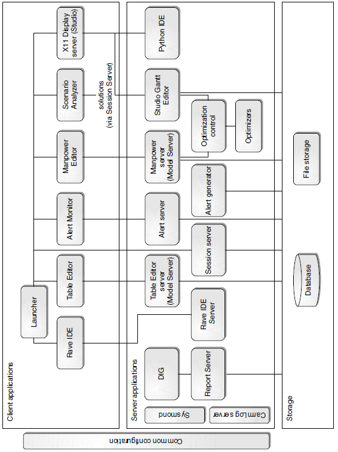
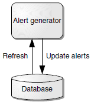
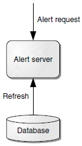
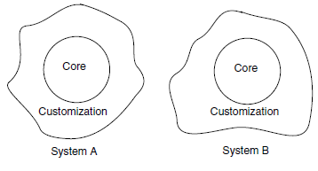
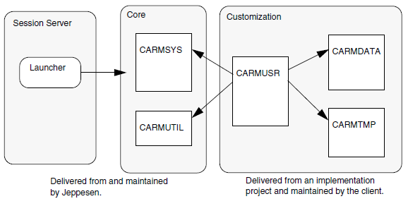

.. _system_overview:

System overview
===============

This chapter gives an overview of the components in a CMS2 system.

System architecture
-------------------

There are two main groups of components in a CMS2 system:

 * Client applications
 * Server applications

   Components in a CMS2 system.

All client applications are started from the Launcher application. Some of
them require services and/or their own server program.
X11 programs (Studio instances and Python IDE) have no client application.
Instead, Launcher connects them to a local Exceed session.
Server applications initiated by a user are started by the server factory part of
the Session Server and distributed using Univa Grid Engine (UGE). UGE is also
used by Optimization control for allocating optimization jobs.
Continuously running server applications are started, stopped, and monitored
by Sysmond. Some of them provide services (alerts, simulated time, reports)
to other programs.
All programs evaluating Rave, except optimizers and Manpower planning,
are currently running as Studio instances.

Client applications
-------------------

This section gives an overview of the client applications in a CMS2 system.

Launcher
^^^^^^^^

Launcher is a small Java client application that handles login with Session
Server, using a Kerberos or PAM server backend. It also provides a toolbar to
launch applications.

Rave IDE
^^^^^^^^

Rave IDE is a development environment for Rave code, which is used for
customization of the system. It is implemented in jEdit.

Alert Monitor
^^^^^^^^^^^^^

Alert Monitor allows a user to monitor alerts caused by rule violations in the
planning data.
Alert Monitor is implemented in Java. It communicates with the Alert Server
by using XML/RPC and polls for new alerts at regular intervals. It also uses
Studio to show details of affected trips and/or rosters with their respective
illegalities or composition problems.

Table Editor
^^^^^^^^^^^^

Table Editor is used to view and edit database tables as well as external tables
on file. Generally, planning data is handled by dedicated applications, such as
Studio, but at times it may be necessary to access data directly.
Table Editor communicates with a Model Server by using XML/RPC.

Scenario Analyzer
^^^^^^^^^^^^^^^^^

Scenario Analyzer is a tool for evaluating scenario solutions by studying various KPI values and trends. It is implemented in Java and uses Session Server
for file system access to solution data by HTTP. Scenario Analyzer may
launch Studio and open a solution by using XML/RPC.

Manpower Editor
^^^^^^^^^^^^^^^

Manpower Editor is the client for the Manpower application, which is used to
perform long-term planning such as vacation and training. The client is written in C# and communicates with a Model Server by using XML/RPC.

X11 display server
^^^^^^^^^^^^^^^^^^

This is a client-side display, keyboard, and mouse server for the server applications Studio and Python IDE.

On-demand server applications
-----------------------------

This section contains an overview of the server components that are started by
a user.

Studio Gantt Editor
^^^^^^^^^^^^^^^^^^^

Studio Gantt Editor provides a Gantt based view of planning data, together
with a set of functions for creating and maintaining the data. However, Studio
is highly customizable and may provide a variety of functions.
An important function of Studio is to visualize the status of the planning data
(illegalities, etc.), which allows a user to evaluate the quality of any edits
before committing them to the plan.

Python IDE
^^^^^^^^^^

Python IDE is a development environment for Python code, which is used for
customization of the system. It is implemented in Eclipse.

Optimization control and optimizers
^^^^^^^^^^^^^^^^^^^^^^^^^^^^^^^^^^^

Within a user session, optimization jobs are started via the optimzation control component.
An optimizer is a program that, based on a problem statement, searches for
the best solution to the problem. The solution is expressed as a set of modifications that result in an optimal plan. In CMS 2 there are 2 different optimizers; Pairing optimizer, Rostering optimizer.

Rave IDE server
^^^^^^^^^^^^^^^

The server component of Rave IDE. This server is started when the user starts
the client from Studio or Launcher.

Model Server
^^^^^^^^^^^^

Model Server holds an object-oriented representation, a generic model, of
planning data and provides APIs for accessing the data.
Table Editor and Manpower Editor use a Model Server instance to interact
with the planning data, and Studio has a built-in Model Server.

Shared server applications
--------------------------

All applications in this category are shared components that are started and
handled by Sysmond.

Sysmond can be used in a High Availability (HA) framework. Currently in
CMS2, only the DIG application supports the HA feature but in future
releases more applications will.

Sysmond
^^^^^^^

The main task of Sysmond is to start the system and keep it running continuously. Sysmond is configured with a number of processes
to start on each node. Depending on the configuration, Sysmond makes sure these processes
are automatically restarted in case they crash or otherwise become unresponsive.
See :ref:`sysmond` for more information.

Common Configuration
^^^^^^^^^^^^^^^^^^^^

This component provides an API to the configuration of all other components.
See :ref:`common_configuration` for more information.

Session Server
^^^^^^^^^^^^^^

Session Server handles authentication and login. It is a number of web application running inside a Tomcat servlet engine, and is configured using Common configuration.
See :ref:`session_server` for more information.

Alert Generator
---------------

Alert Generator scans the planning data, evaluates rules and generates alerts
for illegalities.

   Alert Generator

The application:

 * creates new alerts
 * updates existing alerts
 * marks solved alerts as inactive.

The alerts are stored in an alert table. The rules are modeled in Rave and the
data, including the alert table, is stored in the database.

Alert Server
^^^^^^^^^^^^

Alert Server tracks current alerts. It also reads and writes tasks (groups of
alerts assigned to a user) from the Alert Monitor.

   Alert Server

Report Server
^^^^^^^^^^^^^

A Report Server receives requests for planning information and provides
responses based on the content and customized scripts. It consists of a portal
and workers. The portal routes requests to its workers to share the work,
assuming that they all can handle every type of request.
It is possible to run several report servers to process different types of
requests, for example one report server processing published data and another
for the latest data in the live plan.
See :ref:`system_configuration.report_server` for more information.

Data Integration Gateway (DIG)
^^^^^^^^^^^^^^^^^^^^^^^^^^^^^^

DIG is a toolbox for building the channels that connect the system to external
systems (data feeds).

Third-party products
--------------------

A CMS system uses a number of third-party products that need to be installed
separately, including but not limited to:

 * Univa Grid Engine (formerly Sun Grid Engine)
 * Oracle database
 * OpenText Exceed on Demand
 * Oracle Java

.. _system_overview.files_and_storage:

Files and storage
-----------------

A Jeppesen system consists of two parts: the core and the customization. The
core is identical for all Jeppesen customers, but as the system supports extensive
customization the resulting systems at two different clients may be very different.

   Core and Customization

Session Server is a separate component for handling authentication and keeping track of configurations for users and services. The Session Server configuration is structured into its own CARMSYS and CARMUSR parts.
A typical set-up looks like this:

   A typical set-up

In some cases the CARMDATA may be put in the CARMUSR.
This structure makes it possible to update the core with new releases of
CARMSYS (and CARMUTIL), and at the same time keep the existing customization. It also enables a number of CARMUSRs to either share the same
CARMSYS and CARMDATA or use their own versions. All CARM* parts
correspond to directories in the file system.

Logical parts
^^^^^^^^^^^^^

All Jeppesen systems are divided into the same logical parts:

 * CARMSYS
 * CARMUTIL
 * CARMUSR
 * CARMDATA
 * CARMTMP
 * the database

CARMSYS
+++++++

CARMSYS is the fundamental part of a Jeppesen system. It contains:

 * programs
 * scripts
 * configuration files
 * standard documentation
 * libraries.

CARMSYS is produced by Jeppesen and labeled as a new major version,
with regular service packages. All clients running the same version of Jeppesen have identical CARMSYSs.
It is not unusual to have more than one CARMSYS installed at one time, for
example one for testing and another for production.
A CARMSYS should never be changed after its installation.
Backup of CARMSYS is optional, but recommended.

CARMUTIL
++++++++

A Jeppesen system needs additional third-party products, and this software is
kept in CARMUTIL. Jeppesen delivers a new version of CARMUTIL for
each major version of the CARMSYS.
The CARMUTIL should not be changed after its installation. Backup of
CARMUTIL is not needed.
There are also third-party products not packaged in CARMUTIL that need to
be installed by the customer.

CARMUSR
+++++++

CARMUSR holds all customization of a Jeppesen system. It contains:

 * Rave code
 * reports
 * CSL/Python scripts
 * Unix scripts
 * configuration files
 * client specific documentation.

CARMUSR is created by an implementation project, and is then handed over
to the client. After the hand-over the client is responsible for the development
and maintenance of the CARMUSR, with the support from the Jeppesen Service Centre.
Normally there are several CARMUSRs at a client; for example one for test
and another for production.

Backup of CARMUSR is required. CARMUSR code is often controlled by a
revision control system, for example Mercurial or CVS.

CARMDATA
++++++++

CARMDATA is the data storage part in a Jeppesen system. It contains:

 * all data files, such as plans, input and output data
 * frequently modified configuration files
 * personal settings files.

The location of CARMDATA varies from client to client. It may be organized
as a part of the CARMUSR, or may be placed in a directory structure of its
own. In the latter case the CARMDATA is referenced from the CARMUSR,
allowing several CARMUSRs to share the same CARMDATA.
Frequent backup of CARMDATA is required.

CARMTMP
+++++++

CARMTMP is a temporary work area for a Jeppesen system. It contains files
created during execution, such as log files and compiled Rave code.

Each combination of a CARMSYS and a CARMUSR must have a unique
CARMTMP.

Backup of CARMTMP is optional.

Directories and files
^^^^^^^^^^^^^^^^^^^^^

The CARMSYS, CARMUSR, CARMDATA, and CARMTMP directories are
NFS-mounted in the file system.

CARMSYS
+++++++

The CARMSYS directory includes the following files and directories.

CONFIG
   Main configuration file defining the necessary environment variables.

bin/
   Scripts and binaries.

carmusr_default/
   Default CARMUSR files.

client/
   Client files related to the Session Launcher.

data/config/
   Various configuration files.

data/config/models/
   Schema definition files, defining the core data model.

etc/
   Common configuration data and start scripts.

etc/system_config.xml
   Top-level common configuration file containing default settings.

etc/scripts/
   Contains scripts for starting and stopping system processes.

images
   Images.

lib
   Shared libraries.

src
   Source code for open source components.

CARMUSR
+++++++

The structure of the CARMUSR directory varies from installation to installation. This section contains an example of a typical CARMUSR.

CONFIG_extension
   CARMUSR specific settings of environment variables.

ADM/
   contains files for managing the CARMUSR.

apc_scripts/
   contains CSL/Python scripts used by optimization modules.

bin/
   contains client added scripts and programs.

bin/admin
   contains administration utilities.

crc
   contains mostly files for Rave, for example:
   groupdefs: definition of the Rave parameter form layout.

crc/(source|report|require|modules)/
   contains directory trees for Rave source code files.

crc/etable/
   directory tree containing external and rather static external tables used
   by Rave and the kernel.

crc/etable/(SpLocal|LpLocal)/
   contains fallback external tables for plans.

crc/etable/.GPCSetupEtables/
   contains GUI configuration for external tables.

crc/etable/.BaseConstraints/
   contains default base constraint files.

crc/etable/.BaseDefinitions/
   contains default base definition files.

crc/userlock/
   contains soft-lock files for APC.

crg/(acrot|crew|crr|rtd|leg)_window_(general|object)/
   contains reports the user can generate from studio.

crg/batch_menu
   contains reports possible to generate in batch by using the Jobs >Start Rave Publisher Job command.

crg/hidden/
   contains reports not used directly by the user, for example the Check Legality command and reports generated from CSL scripts.

crg/include/
   contains PDL code included from report definitions, not complete reports.

crg/report_menu/
   contains reports accessed with the Planning Tools >Generate PO files for translation command.

data/Airport/
   contains customer specific airport files.

data/form/
   contains customized versions of form descriptions.

data/config/
   contains customized versions of configuration files, for example:
   
   * ``Strings/Carmen.po``: translated GUI strings
   * ``crew_categories``: crew categories and crew positions definitions
   * ``DateFormats``: permitted date input formats
   * ``default_groups``: default change groups for customer
   * ``leg_keys``: redefined keys for leg matching
   * ``super_chain_user_tags``: frozen user tag names.

data/config/CarmResources/
   contains files defining reources in the Carmen Resource System.

data/config/XResources/
   contains Jeppesen definition of XResources, pixmaps (.pm) and bitmaps (.bm)

etc/
   contains configuration files for all servers and client applications.

lib/
   contains customization code and report sources (in Python)

menu_scripts/
   contains CSL scripts.
   
   `menu_extensions`: modifications of the menus and the toolbar.

Resources/CarmResources/
   contains CRS files.

select_filter
   predefined selection criteria.

CARMDATA
++++++++

The structure of the CARMDATA directory varies from installation to installation. Some clients put CARMDATA files directly in the CARMUSR. This
section describes the typical content of CARMDATA.

LOCAL_PLAN/
   contains local plans and sub-plans.

crg_saved/
   contains saved reports.

crc/parameters/
   contains files created when saving parameter sets.

ETABLE/
   contains external tables used in Rave.

FP_FILES/
   contains SSIM/TPTS files.

INPUT_FILES
   Various external input files

INTX_FILES/
   contains CTF files received from other systems.

OAG_FILES/
   contains OAG files. Accepts compressed files.

OAG_FPLN/
   contains OAG files converted to the Jeppesen format.

data/change_groups/
   contains saved user change group definitions.

selected_plans/
   contains files with saved lists of selected plans.

preferences/
   contains saved personal preferences.

CREW_PLAN/
   contains crew plan files.

GROUND_DUTY_FILES/
   contains ground duty external tables.

CARMTMP
+++++++

The CARMTMP directory includes the following files and directories.

batch/
   contains status and log files generated by the batch system. Normally
   the batch system has its own directory under CARMTMP.

compile/
   contains files used when compiling Rave rule sets. These files are
   reused when a rule set is compiled a second time, which increases the
   speed of the second compilation.

crc/rule_set(APC|GPC|Matador)/
   contains compiled Rave rule sets.
   
   `.(xml|html)`: documentation of the rule set
   
   `$ARCH`: the rule sets.

crc/test_rule_set/
   contains compiled test Rave rule sets.

crc/verify/
   contains files saved from the Show Rule Values command.

crg/
   contains non saved reports.

logfiles/
   contains log files, for example:
   
   `errors.$USER.$HOST`, `editor.$USER.$HOST`: log files for one
   user's Studio run.

XRave/
   contains Rave Explorer files.

CARMUTIL
++++++++

CARMUTIL is a collection if third-party tools and utilities packaged by
Jeppesen.

Database
^^^^^^^^

Most data in the system is saved persistently in a database. On top of the
database, the Jeppesen products use a database API that hides the database
implementation from the Jeppesen products. This API is known as DAVE.
